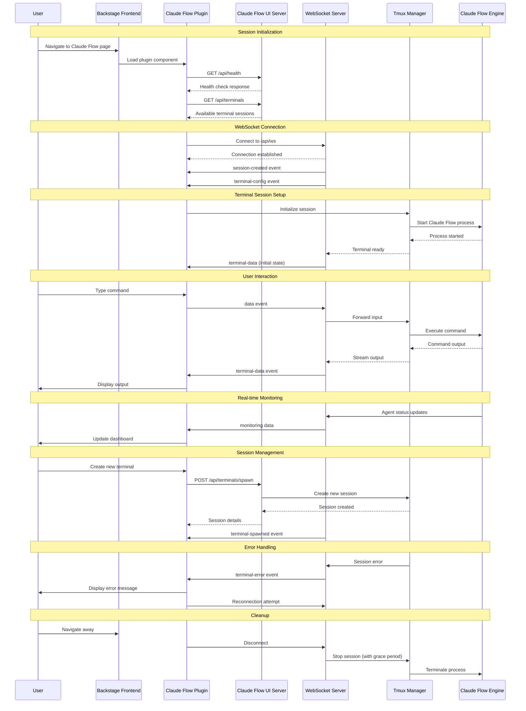

# Claude Flow UI - Backstage Integration Documentation

## Overview

### What is Claude Flow UI

Claude Flow UI is a modern web-based terminal and monitoring interface for Claude Flow, providing real-time system monitoring, terminal session management, and agent orchestration capabilities. It serves as the primary frontend for Claude Flow's SPARC (Specification, Pseudocode, Architecture, Refinement, Completion) methodology with comprehensive Test-Driven Development workflows.

**Key Features:**
- **Terminal Console**: Full keyboard support, command history, multi-session management
- **Monitoring Dashboard**: Real-time memory usage, agent status, prompt tracking, command monitoring
- **WebSocket Integration**: Live streaming I/O with Socket.IO
- **Multi-terminal Support**: Multiple concurrent terminal sessions with tmux integration
- **State Management**: Centralized state with Zustand for seamless UI updates

### Purpose of Backstage Integration

The Backstage integration enables teams to:

1. **Embedded Terminal Access**: Run Claude Flow sessions directly within Backstage's developer portal
2. **Centralized Development**: Access all development tools from a single interface
3. **Team Collaboration**: Share terminal sessions and monitoring dashboards across teams
4. **Workflow Integration**: Integrate Claude Flow into existing DevOps and CI/CD pipelines
5. **Real-time Monitoring**: Monitor agent activities and system performance within Backstage

### Key Benefits and Use Cases

**Benefits:**
- **Unified Developer Experience**: Single pane of glass for all development activities
- **Real-time Collaboration**: Share live terminal sessions and monitoring data
- **Enhanced Productivity**: Seamless context switching between tools
- **Better Observability**: Integrated monitoring and logging capabilities
- **Simplified Deployment**: No separate UI deployment needed

**Use Cases:**
- Development team onboarding and training
- Live code reviews and pair programming sessions
- System monitoring and troubleshooting
- Automated testing and deployment workflows
- Agent orchestration and management

## Architecture

### High-Level Architecture Overview

```
┌─────────────────────────────────────────────────────────────────┐
│                        Backstage Frontend                       │
├─────────────────────────────────────────────────────────────────┤
│  ┌─────────────────┐    ┌─────────────────┐    ┌─────────────────┐ │
│  │   Entity Pages  │    │   Plugin Pages  │    │  Component UI   │ │
│  └─────────────────┘    └─────────────────┘    └─────────────────┘ │
└─────────────────────────────────────────────────────────────────┘
                                    │
                           HTTP/WebSocket
                                    │
┌─────────────────────────────────────────────────────────────────┐
│                   Claude Flow UI Server                         │
├─────────────────────────────────────────────────────────────────┤
│  ┌─────────────────┐    ┌─────────────────┐    ┌─────────────────┐ │
│  │   Next.js App   │    │  Express Server │    │  Socket.IO WS   │ │
│  └─────────────────┘    └─────────────────┘    └─────────────────┘ │
├─────────────────────────────────────────────────────────────────┤
│  ┌─────────────────┐    ┌─────────────────┐    ┌─────────────────┐ │
│  │ Terminal Mgmt   │    │ Tmux Sessions   │    │   Monitoring    │ │
│  └─────────────────┘    └─────────────────┘    └─────────────────┘ │
└─────────────────────────────────────────────────────────────────┘
                                    │
                                    │
┌─────────────────────────────────────────────────────────────────┐
│                      Claude Flow Engine                         │
├─────────────────────────────────────────────────────────────────┤
│  ┌─────────────────┐    ┌─────────────────┐    ┌─────────────────┐ │
│  │ Agent Swarms    │    │ SPARC Pipeline  │    │  Neural Models  │ │
│  └─────────────────┘    └─────────────────┘    └─────────────────┘ │
└─────────────────────────────────────────────────────────────────┘
```

### Component Interaction Patterns

**Frontend Components:**
- **TerminalSidebar**: Session management and navigation
- **Terminal**: XTerm.js-based terminal with full keyboard support
- **MonitoringSidebar**: Real-time system and agent monitoring
- **PerformanceMonitor**: System metrics and performance tracking

**Backend Services:**
- **Unified Server**: Express.js server combining Next.js and WebSocket services
- **TmuxStreamManager**: High-performance terminal session management
- **WebSocket API**: Real-time bidirectional communication
- **Terminal Config API**: Dynamic terminal configuration

### Data Flow and State Management

**State Management Flow:**
1. **Zustand Store**: Centralized state management for UI components
2. **WebSocket Client**: Real-time data synchronization
3. **React Hooks**: Custom hooks for terminal and WebSocket management
4. **Component State**: Local state for UI interactions and optimizations

**Data Flow Patterns:**
- **Terminal Data**: Streams through WebSocket with minimal latency
- **System Metrics**: Polled and cached for dashboard updates
- **Session State**: Synchronized across all connected clients
- **Configuration**: Fetched via REST API and cached locally

## Integration Flow Diagram



## Integration Guide

### Step-by-Step Setup Instructions

#### 1. Install Claude Flow UI Package

```bash
# Install the package
npm install @liamhelmer/claude-flow-ui

# Or with yarn
yarn add @liamhelmer/claude-flow-ui
```

#### 2. Create Backstage Plugin

```bash
# Generate new plugin
yarn create @backstage/plugin

# Install dependencies
cd plugins/claude-flow
yarn add @liamhelmer/claude-flow-ui socket.io-client
```

#### 3. Plugin Configuration

Create the main plugin component:

```typescript
// plugins/claude-flow/src/components/ClaudeFlowPage/ClaudeFlowPage.tsx
import React, { useEffect, useState } from 'react';
import { Grid, Paper, Typography } from '@material-ui/core';
import { useEntity } from '@backstage/plugin-catalog-react';
import { ClaudeFlowUI } from '@liamhelmer/claude-flow-ui';

export const ClaudeFlowPage = () => {
  const { entity } = useEntity();
  const [serverUrl, setServerUrl] = useState<string>('');

  useEffect(() => {
    // Get Claude Flow UI server URL from entity annotations
    const annotations = entity?.metadata?.annotations || {};
    const url = annotations['claude-flow-ui/server-url'] || 'http://localhost:8080';
    setServerUrl(url);
  }, [entity]);

  return (
    <Grid container spacing={3}>
      <Grid item xs={12}>
        <Paper>
          <Typography variant="h4" gutterBottom>
            Claude Flow Terminal
          </Typography>
          {serverUrl && (
            <ClaudeFlowUI
              serverUrl={serverUrl}
              height="600px"
              enableMonitoring={true}
              enableMultiTerminal={true}
            />
          )}
        </Paper>
      </Grid>
    </Grid>
  );
};
```

#### 4. Register Plugin Routes

```typescript
// plugins/claude-flow/src/plugin.ts
import { createPlugin, createRoutableExtension } from '@backstage/core-plugin-api';

export const claudeFlowPlugin = createPlugin({
  id: 'claude-flow',
});

export const ClaudeFlowPage = claudeFlowPlugin.provide(
  createRoutableExtension({
    name: 'ClaudeFlowPage',
    component: () =>
      import('./components/ClaudeFlowPage').then(m => m.ClaudeFlowPage),
    mountPoint: claudeFlowRouteRef,
  }),
);
```

#### 5. App Integration

```typescript
// packages/app/src/App.tsx
import { ClaudeFlowPage } from '@internal/plugin-claude-flow';

<Route path="/claude-flow" element={<ClaudeFlowPage />} />
```

### Configuration Requirements

#### Environment Variables

```bash
# .env
CLAUDE_FLOW_UI_SERVER_URL=http://localhost:8080
CLAUDE_FLOW_UI_WS_URL=ws://localhost:8081
CLAUDE_FLOW_UI_ENABLE_MONITORING=true
CLAUDE_FLOW_UI_ENABLE_MULTI_TERMINAL=true
```

#### Backstage Configuration

```yaml
# app-config.yaml
claudeFlow:
  servers:
    - name: development
      url: http://localhost:8080
      wsUrl: ws://localhost:8081
    - name: production
      url: https://claude-flow-ui.example.com
      wsUrl: wss://claude-flow-ui.example.com/api/ws

  monitoring:
    enabled: true
    refreshInterval: 5000

  terminal:
    defaultCols: 120
    defaultRows: 40
    theme: dark
```

#### Entity Annotations

```yaml
# catalog-info.yaml
apiVersion: backstage.io/v1alpha1
kind: Component
metadata:
  name: my-service
  annotations:
    claude-flow-ui/server-url: http://localhost:8080
    claude-flow-ui/ws-url: ws://localhost:8081
    claude-flow-ui/monitoring: enabled
```

### API Endpoints and Protocols

#### REST API Endpoints

**Health Check**
```
GET /api/health
Response: {
  status: 'ok',
  timestamp: '2024-01-01T00:00:00.000Z',
  services: {
    api: 'running',
    websocket: 'running',
    terminal: 'running'
  }
}
```

**Terminal Configuration**
```
GET /api/terminal-config/:sessionId
Response: {
  cols: 120,
  rows: 40,
  fontSize: 14,
  fontFamily: 'JetBrains Mono, Monaco, monospace',
  theme: { ... },
  sessionId: 'session-id',
  timestamp: 1234567890
}
```

**Terminal Sessions**
```
GET /api/terminals
Response: [
  {
    id: 'terminal-1',
    name: 'Claude Flow',
    command: 'npx claude-flow swarm',
    createdAt: '2024-01-01T00:00:00.000Z'
  }
]
```

**Spawn New Terminal**
```
POST /api/terminals/spawn
Body: {
  name: 'New Terminal',
  command: '/bin/bash'
}
Response: {
  id: 'terminal-2',
  name: 'New Terminal',
  command: '/bin/bash',
  createdAt: '2024-01-01T00:00:00.000Z'
}
```

**Close Terminal**
```
DELETE /api/terminals/:id
Response: { success: true }
```

#### WebSocket Events

**Connection Events**
- `connect`: WebSocket connection established
- `disconnect`: WebSocket connection closed
- `connection-change`: Connection status changed

**Terminal Events**
- `terminal-data`: Terminal output data
- `terminal-error`: Terminal error occurred
- `terminal-resize`: Terminal size changed
- `session-created`: New terminal session created
- `session-destroyed`: Terminal session ended
- `terminal-spawned`: New terminal spawned
- `terminal-closed`: Terminal closed

**Client to Server Events**
- `data`: Send input to terminal
- `resize`: Resize terminal
- `switch-session`: Switch to different terminal session
- `create`: Create new terminal session
- `destroy`: Destroy terminal session

### Request/Response Formats

#### WebSocket Message Format

```typescript
interface WebSocketMessage {
  type: 'data' | 'resize' | 'create' | 'destroy' | 'refresh-history';
  sessionId?: string;
  data?: string;
  cols?: number;
  rows?: number;
  timestamp?: number;
}
```

#### Terminal Data Event

```typescript
interface TerminalDataEvent {
  sessionId: string;
  data: string;
  timestamp?: number;
  isRefreshResponse?: boolean;
}
```

#### Terminal Configuration

```typescript
interface TerminalConfig {
  cols: number;
  rows: number;
  fontSize: number;
  fontFamily: string;
  theme: {
    background: string;
    foreground: string;
    cursor: string;
    // ... other theme properties
  };
  scrollback: number;
  cursorBlink: boolean;
  cursorStyle: 'block' | 'underline' | 'bar';
  // ... other configuration options
}
```

### Authentication Methods

#### Token-based Authentication

```typescript
// Configure authentication in plugin
const authToken = await backstageApi.getAccessToken(['claude-flow-ui']);

const wsClient = new WebSocketClient({
  url: serverUrl,
  auth: {
    token: authToken
  }
});
```

#### Session-based Authentication

```typescript
// Use Backstage identity for session auth
const identity = await identityApi.getProfileInfo();

const config = {
  headers: {
    'X-Backstage-User': identity.email,
    'X-Backstage-Token': await backstageApi.getAccessToken()
  }
};
```

## Code Examples

### Connecting to a Session

```typescript
import { useWebSocket } from '@liamhelmer/claude-flow-ui/hooks';
import { useEffect, useState } from 'react';

export const ClaudeFlowTerminal = ({ serverUrl }: { serverUrl: string }) => {
  const [sessionId, setSessionId] = useState<string>('');
  const { connected, connecting, sendData, on, off, connect } = useWebSocket(serverUrl);

  useEffect(() => {
    const connectToTerminal = async () => {
      try {
        await connect();

        // Listen for session creation
        const handleSessionCreated = (data: { sessionId: string }) => {
          setSessionId(data.sessionId);
          console.log('Connected to terminal session:', data.sessionId);
        };

        on('session-created', handleSessionCreated);

        return () => {
          off('session-created', handleSessionCreated);
        };
      } catch (error) {
        console.error('Failed to connect to terminal:', error);
      }
    };

    connectToTerminal();
  }, [connect, on, off]);

  const handleInput = (data: string) => {
    if (connected && sessionId) {
      sendData(sessionId, data);
    }
  };

  return (
    <div>
      <div>Status: {connected ? 'Connected' : connecting ? 'Connecting...' : 'Disconnected'}</div>
      {sessionId && (
        <Terminal
          sessionId={sessionId}
          onInput={handleInput}
          className="h-96"
        />
      )}
    </div>
  );
};
```

### Handling Terminal Output

```typescript
import { Terminal as XTerminal } from '@xterm/xterm';
import { useEffect, useRef } from 'react';

export const TerminalComponent = ({ sessionId }: { sessionId: string }) => {
  const terminalRef = useRef<HTMLDivElement>(null);
  const xtermRef = useRef<XTerminal | null>(null);
  const { on, off } = useWebSocket();

  useEffect(() => {
    if (terminalRef.current) {
      const terminal = new XTerminal({
        cols: 120,
        rows: 40,
        theme: {
          background: '#1a1b26',
          foreground: '#c0caf5',
        },
      });

      terminal.open(terminalRef.current);
      xtermRef.current = terminal;

      // Handle terminal data
      const handleTerminalData = (data: { sessionId: string; data: string }) => {
        if (data.sessionId === sessionId && xtermRef.current) {
          xtermRef.current.write(data.data);
        }
      };

      on('terminal-data', handleTerminalData);

      return () => {
        off('terminal-data', handleTerminalData);
        terminal.dispose();
      };
    }
  }, [sessionId, on, off]);

  return <div ref={terminalRef} className="terminal-container" />;
};
```

### Managing Session Lifecycle

```typescript
import { useState, useEffect } from 'react';
import { useApi } from '@backstage/core-plugin-api';

export const SessionManager = () => {
  const [sessions, setSessions] = useState<TerminalSession[]>([]);
  const [activeSession, setActiveSession] = useState<string | null>(null);
  const api = useApi(claudeFlowApiRef);

  // Fetch available sessions
  useEffect(() => {
    const fetchSessions = async () => {
      try {
        const response = await fetch('/api/terminals');
        const sessionList = await response.json();
        setSessions(sessionList);

        if (sessionList.length > 0 && !activeSession) {
          setActiveSession(sessionList[0].id);
        }
      } catch (error) {
        console.error('Failed to fetch sessions:', error);
      }
    };

    fetchSessions();
  }, [activeSession]);

  const createSession = async (name: string, command: string) => {
    try {
      const response = await fetch('/api/terminals/spawn', {
        method: 'POST',
        headers: { 'Content-Type': 'application/json' },
        body: JSON.stringify({ name, command }),
      });

      const newSession = await response.json();
      setSessions(prev => [...prev, newSession]);
      setActiveSession(newSession.id);
    } catch (error) {
      console.error('Failed to create session:', error);
    }
  };

  const closeSession = async (sessionId: string) => {
    try {
      await fetch(`/api/terminals/${sessionId}`, {
        method: 'DELETE',
      });

      setSessions(prev => prev.filter(s => s.id !== sessionId));

      if (activeSession === sessionId) {
        const remaining = sessions.filter(s => s.id !== sessionId);
        setActiveSession(remaining.length > 0 ? remaining[0].id : null);
      }
    } catch (error) {
      console.error('Failed to close session:', error);
    }
  };

  return {
    sessions,
    activeSession,
    setActiveSession,
    createSession,
    closeSession,
  };
};
```

### Error Handling Patterns

```typescript
import { useEffect, useState } from 'react';
import { useWebSocket } from '@liamhelmer/claude-flow-ui/hooks';

export const ErrorHandlingTerminal = () => {
  const [error, setError] = useState<string | null>(null);
  const [reconnectAttempts, setReconnectAttempts] = useState(0);
  const { connected, connecting, connect, on, off } = useWebSocket();

  useEffect(() => {
    const handleConnectionError = (errorData: any) => {
      console.error('WebSocket connection error:', errorData);
      setError(errorData.error || 'Connection failed');

      // Implement exponential backoff for reconnection
      const backoffDelay = Math.min(1000 * Math.pow(2, reconnectAttempts), 30000);

      setTimeout(() => {
        if (reconnectAttempts < 5) {
          setReconnectAttempts(prev => prev + 1);
          connect();
        }
      }, backoffDelay);
    };

    const handleTerminalError = (errorData: { sessionId: string; error: string }) => {
      console.error('Terminal error:', errorData);
      setError(`Terminal error: ${errorData.error}`);
    };

    const handleConnectionEstablished = () => {
      setError(null);
      setReconnectAttempts(0);
    };

    on('connection-error', handleConnectionError);
    on('terminal-error', handleTerminalError);
    on('connect', handleConnectionEstablished);

    return () => {
      off('connection-error', handleConnectionError);
      off('terminal-error', handleTerminalError);
      off('connect', handleConnectionEstablished);
    };
  }, [reconnectAttempts, on, off, connect]);

  const clearError = () => {
    setError(null);
    setReconnectAttempts(0);
  };

  const forceReconnect = async () => {
    clearError();
    try {
      await connect();
    } catch (err) {
      setError('Failed to reconnect');
    }
  };

  if (error) {
    return (
      <div className="error-container">
        <h3>Connection Error</h3>
        <p>{error}</p>
        <button onClick={forceReconnect}>Retry Connection</button>
        <button onClick={clearError}>Dismiss</button>
      </div>
    );
  }

  return (
    <div className="terminal-status">
      {connecting && <div>Connecting...</div>}
      {connected && <div>Connected</div>}
      {!connected && !connecting && <div>Disconnected</div>}
    </div>
  );
};
```

## Troubleshooting

### Common Issues and Solutions

#### 1. WebSocket Connection Failed

**Symptoms:**
- Terminal not loading
- "Connection failed" error messages
- Network errors in browser console

**Solutions:**

```typescript
// Check WebSocket URL configuration
const wsUrl = process.env.REACT_APP_WS_URL || 'ws://localhost:8081';

// Verify CORS configuration
const corsOptions = {
  origin: ['http://localhost:3000', 'https://backstage.example.com'],
  methods: ['GET', 'POST'],
  credentials: true
};

// Test connection manually
const testConnection = async () => {
  try {
    const response = await fetch('/api/health');
    const health = await response.json();
    console.log('Server health:', health);
  } catch (error) {
    console.error('Health check failed:', error);
  }
};
```

#### 2. Terminal Not Responding to Input

**Symptoms:**
- Keystrokes not appearing in terminal
- Commands not executing
- Terminal appears frozen

**Solutions:**

```typescript
// Check session ID matching
const handleInput = (data: string) => {
  console.log('Sending input to session:', sessionId);
  if (connected && sessionId) {
    sendData(sessionId, data);
  } else {
    console.warn('Not connected or no session ID');
  }
};

// Verify event listener registration
useEffect(() => {
  const handleKeyPress = (e: KeyboardEvent) => {
    if (e.target === terminalRef.current) {
      handleInput(e.key);
    }
  };

  terminalRef.current?.addEventListener('keypress', handleKeyPress);
  return () => {
    terminalRef.current?.removeEventListener('keypress', handleKeyPress);
  };
}, [sessionId]);
```

#### 3. Session Management Issues

**Symptoms:**
- Multiple sessions not working
- Session switching failures
- Session cleanup problems

**Solutions:**

```typescript
// Proper session cleanup
useEffect(() => {
  return () => {
    // Cleanup on unmount
    if (sessionId && wsClient) {
      wsClient.send('destroy', { sessionId });
    }
  };
}, [sessionId]);

// Session validation
const validateSession = async (sessionId: string) => {
  try {
    const response = await fetch(`/api/terminals/${sessionId}`);
    if (!response.ok) {
      throw new Error('Session not found');
    }
    return true;
  } catch (error) {
    console.error('Session validation failed:', error);
    return false;
  }
};
```

### Debug Logging

```typescript
// Enable debug logging
const enableDebugLogging = () => {
  localStorage.setItem('debug', 'claude-flow-ui:*');

  // Or set environment variable
  process.env.DEBUG = 'claude-flow-ui:*';
};

// Custom debug logger
const debug = (namespace: string) => (message: string, ...args: any[]) => {
  if (process.env.NODE_ENV === 'development') {
    console.log(`[${namespace}] ${message}`, ...args);
  }
};

const log = debug('claude-flow-ui:terminal');
log('Terminal initialized with session:', sessionId);
```

### Performance Considerations

#### Memory Management

```typescript
// Prevent memory leaks in terminals
useEffect(() => {
  const terminal = new XTerminal({
    scrollback: 1000, // Limit scrollback buffer
  });

  // Set up disposal
  const dispose = () => {
    terminal.dispose();
  };

  window.addEventListener('beforeunload', dispose);

  return () => {
    window.removeEventListener('beforeunload', dispose);
    dispose();
  };
}, []);
```

#### Connection Pooling

```typescript
// Singleton WebSocket client
class WebSocketManager {
  private static instance: WebSocketManager;
  private connections: Map<string, WebSocketClient> = new Map();

  static getInstance(): WebSocketManager {
    if (!WebSocketManager.instance) {
      WebSocketManager.instance = new WebSocketManager();
    }
    return WebSocketManager.instance;
  }

  getConnection(url: string): WebSocketClient {
    if (!this.connections.has(url)) {
      this.connections.set(url, new WebSocketClient(url));
    }
    return this.connections.get(url)!;
  }
}
```

#### Data Streaming Optimization

```typescript
// Throttle terminal data updates
import { throttle } from 'lodash';

const throttledWrite = throttle((data: string) => {
  if (terminal) {
    terminal.write(data);
  }
}, 16); // ~60fps

// Batch terminal updates
let pendingData = '';
const flushTerminalData = () => {
  if (pendingData && terminal) {
    terminal.write(pendingData);
    pendingData = '';
  }
};

const handleTerminalData = (data: string) => {
  pendingData += data;
  requestAnimationFrame(flushTerminalData);
};
```

### Network and Firewall Configuration

```bash
# Check port accessibility
netstat -an | grep :8080
netstat -an | grep :8081

# Test WebSocket connection
curl -i -N \
  -H "Connection: Upgrade" \
  -H "Upgrade: websocket" \
  -H "Sec-WebSocket-Key: SGVsbG8sIHdvcmxkIQ==" \
  -H "Sec-WebSocket-Version: 13" \
  http://localhost:8081/api/ws

# Configure firewall (if needed)
sudo ufw allow 8080
sudo ufw allow 8081
```

### Browser Compatibility

```typescript
// Check WebSocket support
const checkWebSocketSupport = () => {
  if (!window.WebSocket) {
    throw new Error('WebSocket not supported in this browser');
  }
};

// Polyfill for older browsers
import 'core-js/stable';
import 'regenerator-runtime/runtime';
```

---

This documentation provides comprehensive guidance for integrating Claude Flow UI with Backstage, including architecture details, setup instructions, API references, code examples, and troubleshooting guides. The integration enables teams to leverage Claude Flow's powerful development capabilities directly within their Backstage developer portal.