# Performance Testing Setup Architecture

## Overview

This document defines the comprehensive performance testing architecture for claude-flow-ui, implementing load testing, stress testing, and performance monitoring with K6, Lighthouse, and custom benchmarking tools.

## Performance Testing Architecture

```mermaid
graph TB
    subgraph "Performance Test Categories"
        LOAD[Load Testing<br/>K6 + Artillery]
        STRESS[Stress Testing<br/>Breaking Point Analysis]
        SPIKE[Spike Testing<br/>Traffic Surge Simulation]
        VOLUME[Volume Testing<br/>Large Dataset Handling]
        ENDURANCE[Endurance Testing<br/>Long Duration Stability]
    end

    subgraph "Frontend Performance"
        LIGHTHOUSE[Lighthouse CI<br/>Web Vitals]
        BUNDLE[Bundle Analysis<br/>Webpack Bundle Analyzer]
        RUNTIME[Runtime Profiling<br/>Chrome DevTools]
        MEMORY[Memory Profiling<br/>Heap Snapshots]
    end

    subgraph "Backend Performance"
        API_LOAD[API Load Testing<br/>Request/Response Times]
        DB_PERF[Database Performance<br/>Query Optimization]
        WS_PERF[WebSocket Performance<br/>Real-time Metrics]
        RESOURCE[Resource Monitoring<br/>CPU/Memory/I/O]
    end

    subgraph "Monitoring & Analysis"
        REAL_TIME[Real-time Monitoring<br/>Prometheus + Grafana]
        ALERTS[Performance Alerts<br/>Threshold-based]
        REPORTS[Performance Reports<br/>Trend Analysis]
        BUDGETS[Performance Budgets<br/>Regression Detection]
    end

    LOAD --> REAL_TIME
    STRESS --> ALERTS
    LIGHTHOUSE --> REPORTS
    API_LOAD --> BUDGETS

    style LOAD fill:#fff3e0
    style LIGHTHOUSE fill:#e8f5e8
    style API_LOAD fill:#e1f5fe
    style REAL_TIME fill:#ffebee
```



## K6 Load Testing Framework

### Load Test Configuration
```javascript
// tests/performance/k6/load-test-config.js
import { check, group, sleep } from 'k6';
import http from 'k6/http';
import ws from 'k6/ws';
import { Counter, Rate, Trend, Gauge } from 'k6/metrics';

// Custom metrics
export const errorRate = new Rate('error_rate');
export const responseTime = new Trend('response_time');
export const activeConnections = new Gauge('active_connections');
export const messagesSent = new Counter('messages_sent');

// Test configuration
export const options = {
  stages: [
    { duration: '2m', target: 10 },    // Ramp up to 10 users
    { duration: '5m', target: 10 },    // Stay at 10 users
    { duration: '2m', target: 20 },    // Ramp up to 20 users
    { duration: '5m', target: 20 },    // Stay at 20 users
    { duration: '2m', target: 50 },    // Ramp up to 50 users
    { duration: '5m', target: 50 },    // Stay at 50 users
    { duration: '5m', target: 0 },     // Ramp down to 0 users
  ],
  thresholds: {
    http_req_duration: ['p(95)<500'], // 95% of requests must complete below 500ms
    http_req_failed: ['rate<0.1'],    // Error rate should be below 10%
    error_rate: ['rate<0.05'],        // Custom error rate below 5%
    response_time: ['p(90)<300'],     // 90% of responses under 300ms
  },
  ext: {
    loadimpact: {
      distribution: {
        'amazon:us:ashburn': { loadZone: 'amazon:us:ashburn', percent: 50 },
        'amazon:ie:dublin': { loadZone: 'amazon:ie:dublin', percent: 50 },
      },
    },
  },
};

// Main test function
export default function() {
  group('Terminal Application Load Test', function() {
    // Test homepage load
    const homeResponse = http.get('http://localhost:11235');
    check(homeResponse, {
      'homepage status is 200': (r) => r.status === 200,
      'homepage loads in <2s': (r) => r.timings.duration < 2000,
    });
    responseTime.add(homeResponse.timings.duration);

    // Test API endpoints
    group('API Endpoints', function() {
      const apiResponse = http.get('http://localhost:11235/api/health');
      check(apiResponse, {
        'API health check returns 200': (r) => r.status === 200,
        'API responds in <100ms': (r) => r.timings.duration < 100,
      });
    });

    // Test WebSocket connection
    group('WebSocket Connection', function() {
      const wsUrl = 'ws://localhost:11235/socket.io/?transport=websocket';
      const response = ws.connect(wsUrl, function(socket) {
        socket.on('open', function() {
          activeConnections.add(1);

          // Send test messages
          for (let i = 0; i < 10; i++) {
            socket.send(JSON.stringify({
              type: 'terminal-command',
              payload: { command: `echo "Test message ${i}"` }
            }));
            messagesSent.add(1);
            sleep(0.1);
          }
        });

        socket.on('message', function(message) {
          const data = JSON.parse(message);
          check(data, {
            'WebSocket message received': (d) => d !== null,
            'WebSocket message has type': (d) => d.type !== undefined,
          });
        });

        socket.on('close', function() {
          activeConnections.add(-1);
        });

        socket.on('error', function(error) {
          errorRate.add(1);
          console.error('WebSocket error:', error);
        });
      });

      check(response, {
        'WebSocket connection successful': (r) => r && r.status === 101,
      });
    });

    sleep(1);
  });
}

// Setup and teardown functions
export function setup() {
  // Warm up the application
  const warmupResponse = http.get('http://localhost:11235');
  console.log('Warmup response status:', warmupResponse.status);

  return { timestamp: Date.now() };
}

export function teardown(data) {
  console.log('Test completed at:', new Date(data.timestamp));

  // Generate performance summary
  const summary = {
    testDuration: Date.now() - data.timestamp,
    timestamp: data.timestamp,
  };

  console.log('Performance test summary:', JSON.stringify(summary, null, 2));
}
```

### Stress Testing Configuration
```javascript
// tests/performance/k6/stress-test.js
export const options = {
  stages: [
    { duration: '5m', target: 100 },   // Ramp up to 100 users
    { duration: '10m', target: 200 },  // Ramp up to 200 users
    { duration: '5m', target: 300 },   // Ramp up to 300 users
    { duration: '10m', target: 400 },  // Ramp up to 400 users
    { duration: '5m', target: 500 },   // Ramp up to 500 users - breaking point
    { duration: '10m', target: 500 },  // Hold at 500 users
    { duration: '10m', target: 0 },    // Ramp down to 0 users
  ],
  thresholds: {
    http_req_duration: ['p(95)<1000'],  // Relaxed threshold for stress test
    http_req_failed: ['rate<0.3'],      // Allow higher error rate
  },
};

export default function() {
  // Stress test scenarios with heavier payloads
  const heavyPayload = {
    command: 'find / -type f -name "*.js" | head -1000',
    metadata: {
      timestamp: Date.now(),
      sessionId: `session-${__VU}-${__ITER}`,
      heavyData: 'x'.repeat(10000), // 10KB payload
    }
  };

  const response = http.post('http://localhost:11235/api/terminal/execute',
    JSON.stringify(heavyPayload), {
    headers: { 'Content-Type': 'application/json' },
  });

  check(response, {
    'stress test request completed': (r) => r.status !== 0,
    'server handles heavy load': (r) => r.status < 500 || r.status === 503, // Allow service unavailable
  });

  sleep(Math.random() * 2); // Variable wait time
}
```

## Lighthouse Performance Testing

### Lighthouse CI Configuration
```javascript
// tests/performance/lighthouse/lighthouse-config.js
module.exports = {
  ci: {
    collect: {
      url: ['http://localhost:11235'],
      startServerCommand: 'npm run server',
      startServerReadyPattern: 'Server running on port',
      startServerReadyTimeout: 60000,
      numberOfRuns: 3,
      settings: {
        preset: 'desktop',
        chromeFlags: ['--no-sandbox', '--headless'],
        onlyAudits: [
          'first-contentful-paint',
          'largest-contentful-paint',
          'first-meaningful-paint',
          'speed-index',
          'interactive',
          'cumulative-layout-shift',
          'total-blocking-time',
        ],
      },
    },
    assert: {
      assertions: {
        'categories:performance': ['error', { minScore: 0.9 }],
        'categories:accessibility': ['error', { minScore: 0.9 }],
        'categories:best-practices': ['error', { minScore: 0.9 }],
        'categories:seo': ['error', { minScore: 0.8 }],
        'first-contentful-paint': ['error', { maxNumericValue: 1800 }],
        'largest-contentful-paint': ['error', { maxNumericValue: 2500 }],
        'cumulative-layout-shift': ['error', { maxNumericValue: 0.1 }],
        'total-blocking-time': ['error', { maxNumericValue: 300 }],
      },
    },
    upload: {
      target: 'temporary-public-storage',
    },
  },
};
```

### Custom Performance Monitoring
```typescript
// tests/performance/monitoring/performance-monitor.ts
export class PerformanceMonitor {
  private metrics: Map<string, PerformanceMetric> = new Map();
  private observers: PerformanceObserver[] = [];

  constructor() {
    this.setupObservers();
  }

  private setupObservers() {
    // Navigation timing observer
    const navigationObserver = new PerformanceObserver((list) => {
      for (const entry of list.getEntries()) {
        this.recordNavigationTiming(entry as PerformanceNavigationTiming);
      }
    });
    navigationObserver.observe({ entryTypes: ['navigation'] });
    this.observers.push(navigationObserver);

    // Resource timing observer
    const resourceObserver = new PerformanceObserver((list) => {
      for (const entry of list.getEntries()) {
        this.recordResourceTiming(entry as PerformanceResourceTiming);
      }
    });
    resourceObserver.observe({ entryTypes: ['resource'] });
    this.observers.push(resourceObserver);

    // Memory usage observer (if available)
    if ('memory' in performance) {
      setInterval(() => {
        this.recordMemoryUsage();
      }, 5000);
    }
  }

  private recordNavigationTiming(entry: PerformanceNavigationTiming) {
    const metrics = {
      dnsLookupTime: entry.domainLookupEnd - entry.domainLookupStart,
      tcpConnectionTime: entry.connectEnd - entry.connectStart,
      requestTime: entry.responseStart - entry.requestStart,
      responseTime: entry.responseEnd - entry.responseStart,
      domParsingTime: entry.domContentLoadedEventEnd - entry.domContentLoadedEventStart,
      pageLoadTime: entry.loadEventEnd - entry.loadEventStart,
      firstContentfulPaint: this.getFirstContentfulPaint(),
      largestContentfulPaint: this.getLargestContentfulPaint(),
    };

    for (const [key, value] of Object.entries(metrics)) {
      this.recordMetric(key, value);
    }
  }

  private recordResourceTiming(entry: PerformanceResourceTiming) {
    const resourceType = this.getResourceType(entry.name);
    const loadTime = entry.responseEnd - entry.startTime;

    this.recordMetric(`resource-load-time-${resourceType}`, loadTime);
    this.recordMetric('total-resource-size', entry.transferSize || 0);
  }

  private recordMemoryUsage() {
    const memory = (performance as any).memory;
    if (memory) {
      this.recordMetric('js-heap-size-used', memory.usedJSHeapSize);
      this.recordMetric('js-heap-size-total', memory.totalJSHeapSize);
      this.recordMetric('js-heap-size-limit', memory.jsHeapSizeLimit);
    }
  }

  private getFirstContentfulPaint(): number {
    const entries = performance.getEntriesByType('paint');
    const fcpEntry = entries.find(entry => entry.name === 'first-contentful-paint');
    return fcpEntry ? fcpEntry.startTime : 0;
  }

  private getLargestContentfulPaint(): number {
    return new Promise((resolve) => {
      const observer = new PerformanceObserver((list) => {
        const entries = list.getEntries();
        const lastEntry = entries[entries.length - 1];
        resolve(lastEntry.startTime);
        observer.disconnect();
      });
      observer.observe({ entryTypes: ['largest-contentful-paint'] });
    });
  }

  private getResourceType(url: string): string {
    if (url.includes('.js')) return 'javascript';
    if (url.includes('.css')) return 'stylesheet';
    if (url.match(/\.(png|jpg|jpeg|gif|svg|webp)$/)) return 'image';
    if (url.includes('/api/')) return 'api';
    return 'other';
  }

  public recordMetric(name: string, value: number) {
    if (!this.metrics.has(name)) {
      this.metrics.set(name, {
        name,
        values: [],
        min: Infinity,
        max: -Infinity,
        sum: 0,
        count: 0,
      });
    }

    const metric = this.metrics.get(name)!;
    metric.values.push(value);
    metric.min = Math.min(metric.min, value);
    metric.max = Math.max(metric.max, value);
    metric.sum += value;
    metric.count++;
  }

  public getMetrics(): PerformanceReport {
    const report: PerformanceReport = {
      timestamp: Date.now(),
      metrics: {},
      summary: this.generateSummary(),
    };

    for (const [name, metric] of this.metrics.entries()) {
      report.metrics[name] = {
        ...metric,
        average: metric.sum / metric.count,
        median: this.calculateMedian(metric.values),
        p95: this.calculatePercentile(metric.values, 95),
        p99: this.calculatePercentile(metric.values, 99),
      };
    }

    return report;
  }

  private generateSummary(): PerformanceSummary {
    return {
      pageLoadTime: this.getMetricValue('pageLoadTime'),
      firstContentfulPaint: this.getMetricValue('firstContentfulPaint'),
      largestContentfulPaint: this.getMetricValue('largestContentfulPaint'),
      memoryUsage: this.getMetricValue('js-heap-size-used'),
      resourceCount: this.metrics.size,
      performanceScore: this.calculatePerformanceScore(),
    };
  }

  private calculatePerformanceScore(): number {
    const weights = {
      pageLoadTime: 0.3,
      firstContentfulPaint: 0.25,
      largestContentfulPaint: 0.25,
      memoryUsage: 0.2,
    };

    let score = 100;

    // Deduct points based on performance thresholds
    const pageLoadTime = this.getMetricValue('pageLoadTime');
    if (pageLoadTime > 3000) score -= (pageLoadTime - 3000) / 100 * weights.pageLoadTime * 10;

    const fcp = this.getMetricValue('firstContentfulPaint');
    if (fcp > 1800) score -= (fcp - 1800) / 100 * weights.firstContentfulPaint * 10;

    const lcp = this.getMetricValue('largestContentfulPaint');
    if (lcp > 2500) score -= (lcp - 2500) / 100 * weights.largestContentfulPaint * 10;

    const memory = this.getMetricValue('js-heap-size-used');
    if (memory > 50 * 1024 * 1024) { // 50MB threshold
      score -= (memory - 50 * 1024 * 1024) / (1024 * 1024) * weights.memoryUsage;
    }

    return Math.max(0, Math.min(100, score));
  }

  private getMetricValue(name: string): number {
    const metric = this.metrics.get(name);
    return metric ? metric.sum / metric.count : 0;
  }

  private calculateMedian(values: number[]): number {
    const sorted = [...values].sort((a, b) => a - b);
    const mid = Math.floor(sorted.length / 2);
    return sorted.length % 2 === 0
      ? (sorted[mid - 1] + sorted[mid]) / 2
      : sorted[mid];
  }

  private calculatePercentile(values: number[], percentile: number): number {
    const sorted = [...values].sort((a, b) => a - b);
    const index = Math.ceil(sorted.length * percentile / 100) - 1;
    return sorted[Math.max(0, index)];
  }

  public cleanup() {
    this.observers.forEach(observer => observer.disconnect());
    this.metrics.clear();
  }
}

// Type definitions
interface PerformanceMetric {
  name: string;
  values: number[];
  min: number;
  max: number;
  sum: number;
  count: number;
}

interface PerformanceReport {
  timestamp: number;
  metrics: Record<string, PerformanceMetric & {
    average: number;
    median: number;
    p95: number;
    p99: number;
  }>;
  summary: PerformanceSummary;
}

interface PerformanceSummary {
  pageLoadTime: number;
  firstContentfulPaint: number;
  largestContentfulPaint: number;
  memoryUsage: number;
  resourceCount: number;
  performanceScore: number;
}
```

## Performance Budgets and Thresholds

### Budget Configuration
```typescript
// tests/performance/budgets/performance-budgets.ts
export const performanceBudgets = {
  // Page load metrics (milliseconds)
  timing: {
    firstContentfulPaint: 1800,
    largestContentfulPaint: 2500,
    firstInputDelay: 100,
    cumulativeLayoutShift: 0.1,
    timeToInteractive: 3800,
    totalBlockingTime: 300,
  },

  // Resource size budgets (bytes)
  resources: {
    totalSize: 2 * 1024 * 1024, // 2MB total
    javascript: 500 * 1024,     // 500KB JS
    css: 100 * 1024,            // 100KB CSS
    images: 1 * 1024 * 1024,    // 1MB images
    fonts: 200 * 1024,          // 200KB fonts
  },

  // Network metrics
  network: {
    requestCount: 50,           // Max 50 requests
    serverResponseTime: 200,    // 200ms server response
    apiResponseTime: 100,       // 100ms API response
  },

  // Runtime performance
  runtime: {
    memoryUsage: 50 * 1024 * 1024, // 50MB memory limit
    cpuUsage: 80,                   // 80% CPU usage
    frameRate: 60,                  // 60fps minimum
  },
};

export const performanceAlerts = {
  critical: {
    pageLoadTime: 5000,         // 5s critical threshold
    memoryLeak: 100 * 1024 * 1024, // 100MB memory leak
    errorRate: 0.05,            // 5% error rate
  },
  warning: {
    pageLoadTime: 3000,         // 3s warning threshold
    memoryUsage: 75 * 1024 * 1024, // 75MB memory warning
    responseTime: 1000,         // 1s response time warning
  },
};
```

This performance testing setup provides comprehensive monitoring and benchmarking capabilities for the claude-flow-ui project, ensuring optimal performance across all user scenarios and system loads.