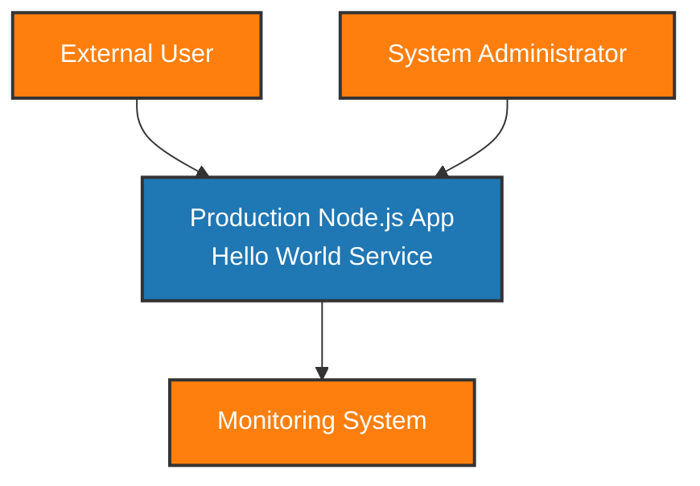
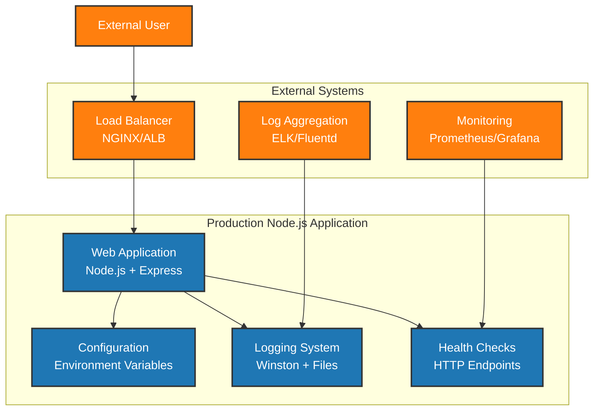
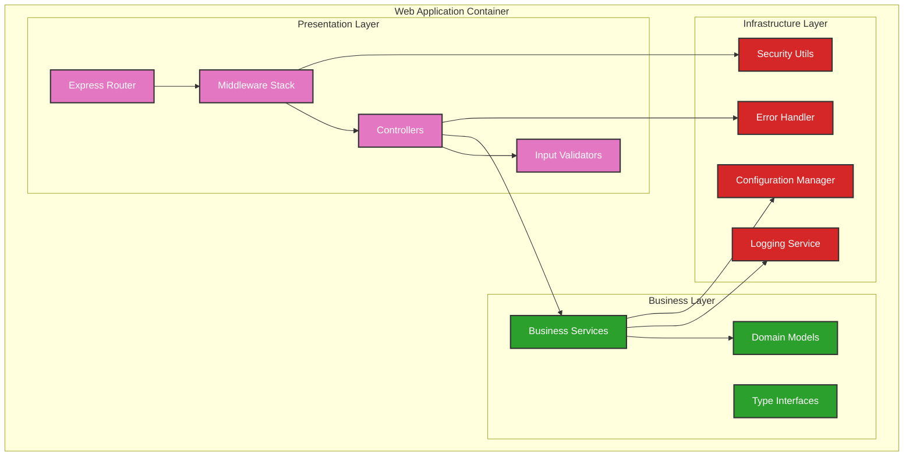
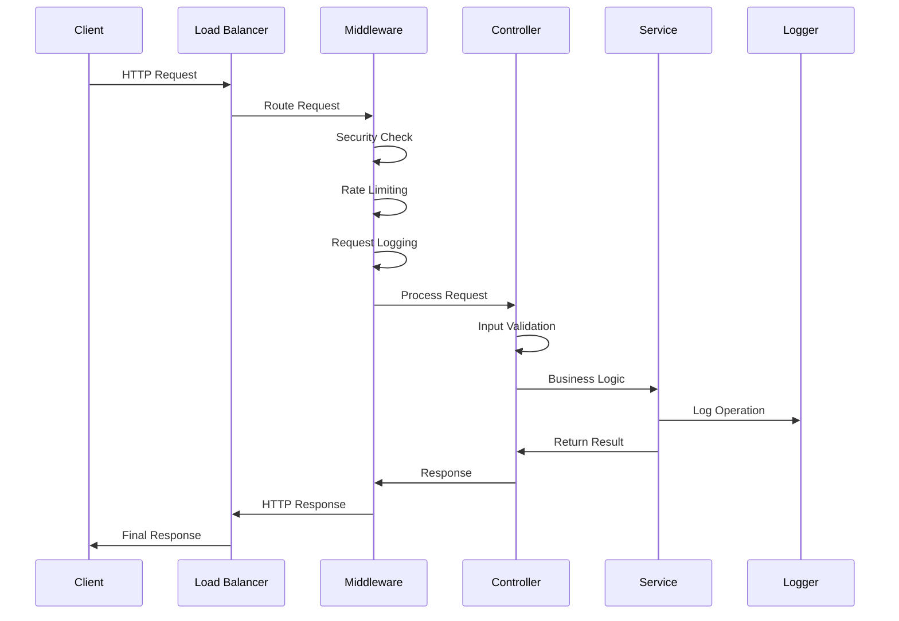
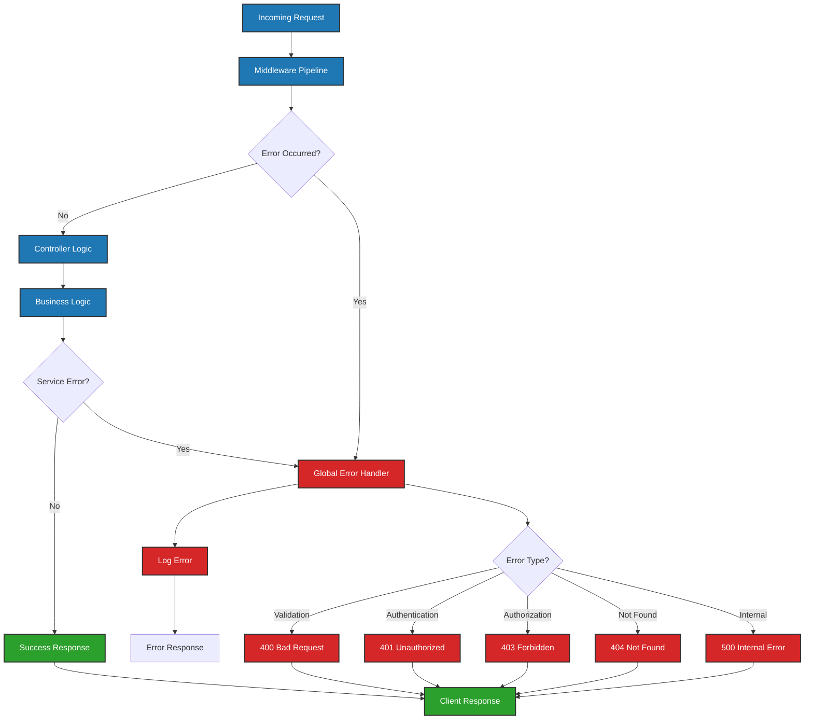
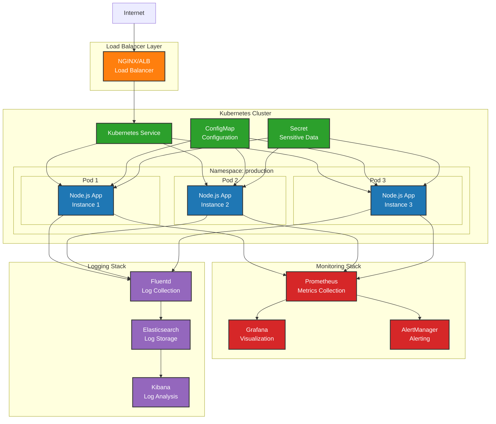
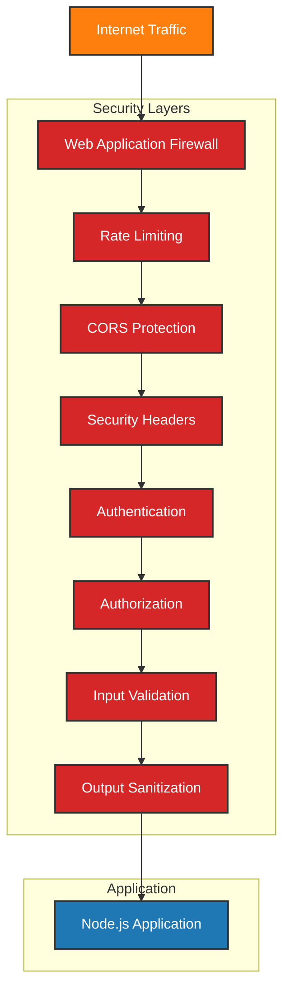
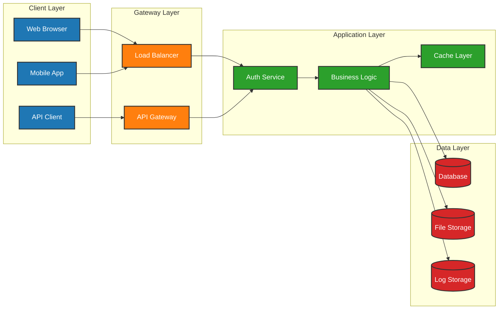
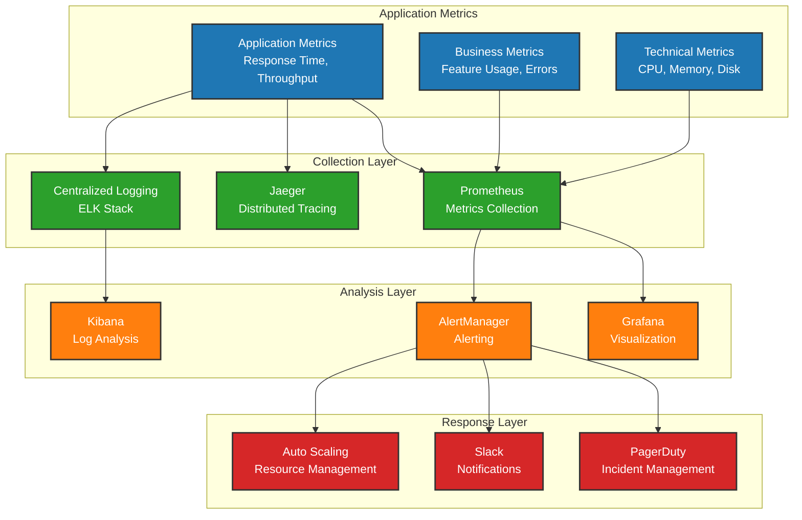

# System Architecture Diagrams

## Overview
This document contains architectural diagrams for the production-ready Node.js hello world application using C4 model notation.

## C4 Model Level 1: System Context



## C4 Model Level 2: Container Diagram



## C4 Model Level 3: Component Diagram



## Request Flow Diagram



## Error Handling Flow



## Health Check Architecture

```mermaid
graph TD
    subgraph "Health Check Endpoints"
        Liveness[/health/live<br/>Liveness Probe]
        Readiness[/health/ready<br/>Readiness Probe]
        Comprehensive[/health<br/>Comprehensive Check]
    end

    subgraph "Health Checkers"
        AppHealth[Application Health]
        DBHealth[Database Health]
        CacheHealth[Cache Health]
        ExtHealth[External Service Health]
    end

    subgraph "Monitoring Systems"
        K8s[Kubernetes Probes]
        Prometheus[Prometheus Metrics]
        AlertManager[Alert Manager]
    end

    Liveness --> AppHealth
    Readiness --> DBHealth
    Readiness --> CacheHealth
    Comprehensive --> AppHealth
    Comprehensive --> DBHealth
    Comprehensive --> CacheHealth
    Comprehensive --> ExtHealth

    K8s --> Liveness
    K8s --> Readiness
    Prometheus --> Comprehensive
    AlertManager --> Prometheus

    classDef endpoint fill:#1f77b4,stroke:#333,stroke-width:2px,color:#fff
    classDef checker fill:#2ca02c,stroke:#333,stroke-width:2px,color:#fff
    classDef monitor fill:#ff7f0e,stroke:#333,stroke-width:2px,color:#fff

    class Liveness,Readiness,Comprehensive endpoint
    class AppHealth,DBHealth,CacheHealth,ExtHealth checker
    class K8s,Prometheus,AlertManager monitor
```

## Deployment Architecture



## Security Architecture



## Data Flow Architecture



## Performance Monitoring Architecture



## Notes
- All diagrams use standard C4 model notation
- Security considerations are integrated throughout the architecture
- Performance and monitoring are built-in from the start
- The architecture supports both horizontal and vertical scaling
- Health checks are designed for Kubernetes deployment patterns