# System Architecture Diagrams

## Overview

This document contains comprehensive architectural diagrams for the REST API system, including C4 model diagrams, component interactions, and data flow visualizations.

## C4 Model Architecture

### Level 1: System Context Diagram

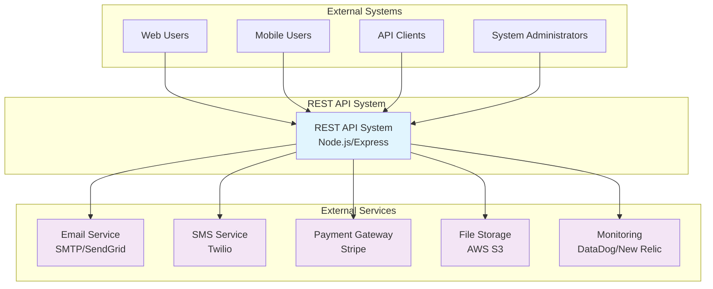

### Level 2: Container Diagram

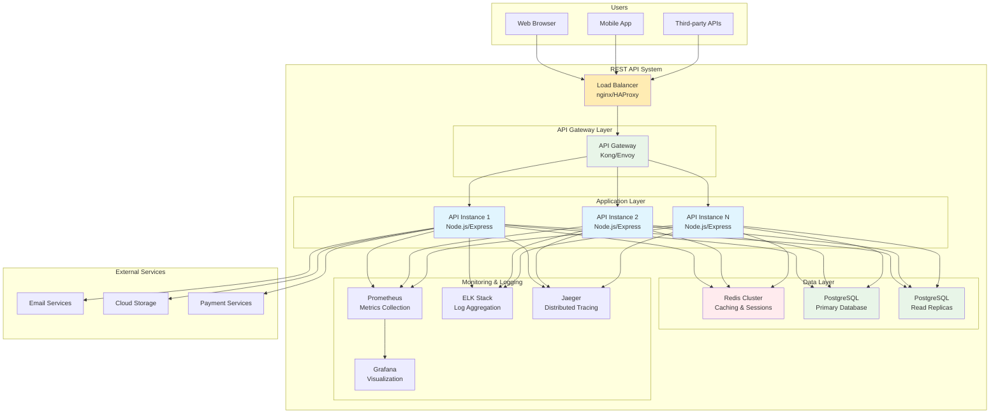

### Level 3: Component Diagram (Application Layer)

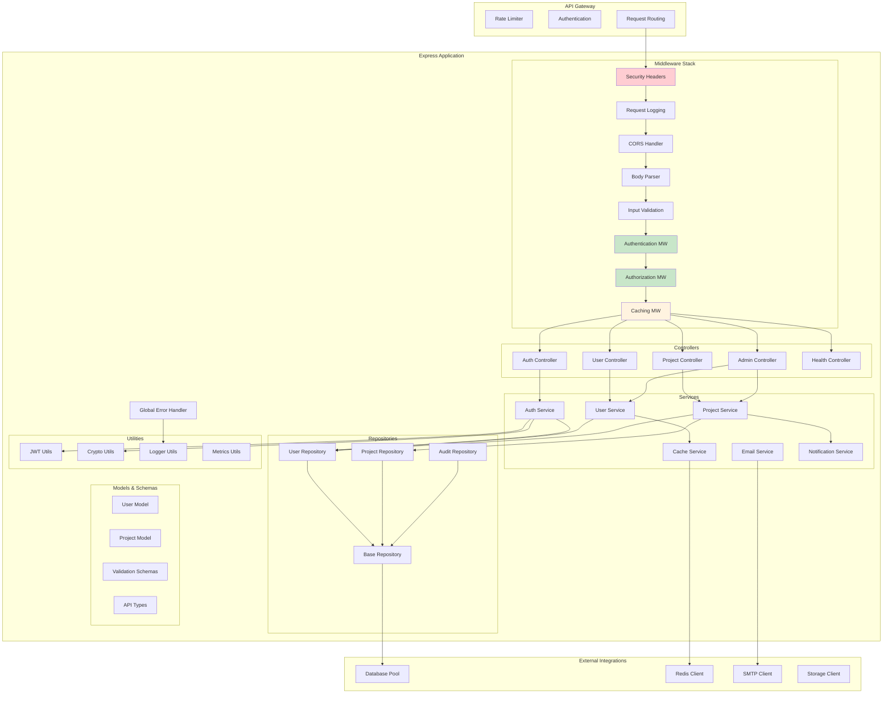

## Data Flow Diagrams

### User Authentication Flow

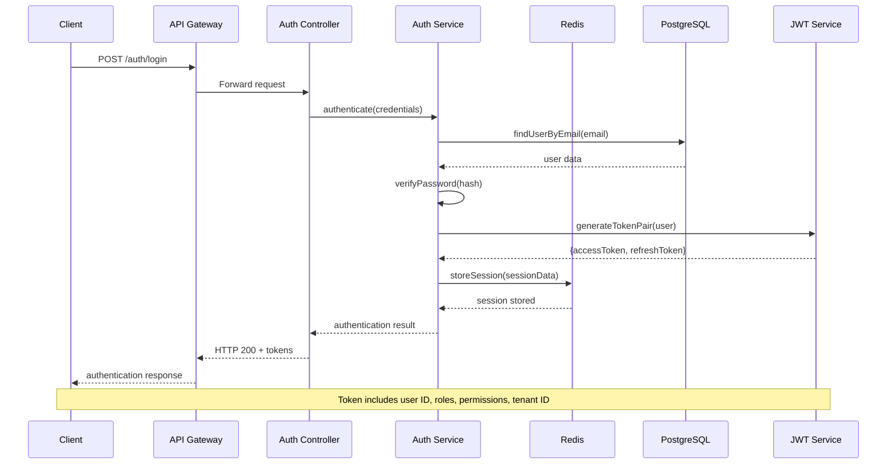

### API Request Processing Flow

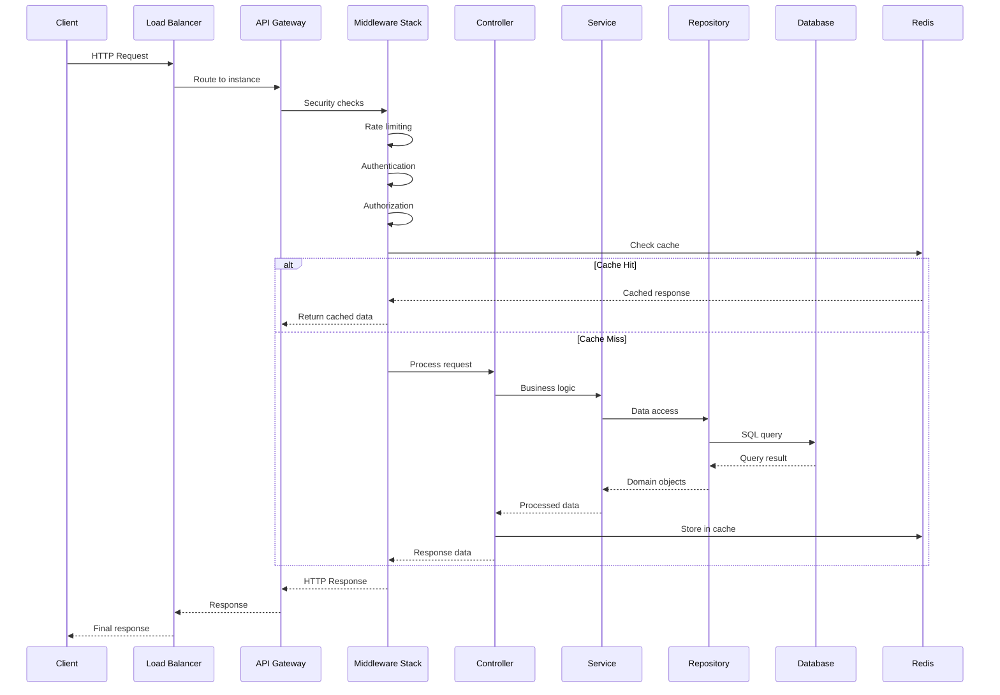

### Multi-Tenant Data Isolation Flow

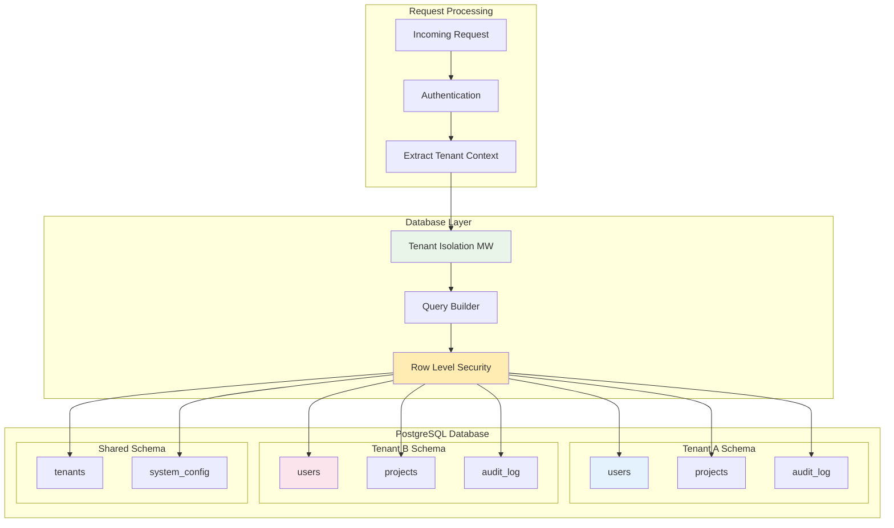

### Caching Strategy Diagram

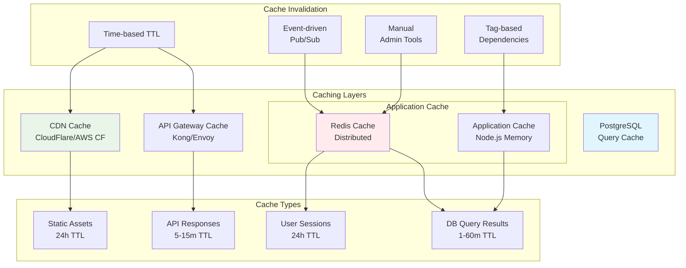

## Security Architecture Diagram

```mermaid
graph TB
    subgraph "Security Layers"
        subgraph "Network Security"
            WAF[Web Application Firewall]
            DDoS[DDoS Protection]
            FIREWALL[Network Firewall]
        end

        subgraph "Application Security"
            RATE_LIMIT[Rate Limiting]
            INPUT_VAL[Input Validation]
            OUTPUT_ENC[Output Encoding]
            SQL_INJECT[SQL Injection Prevention]
            XSS_PROTECT[XSS Protection]
        end

        subgraph "Authentication & Authorization"
            JWT_AUTH[JWT Authentication]
            MFA[Multi-Factor Auth]
            RBAC[Role-Based Access Control]
            TENANT_ISO[Tenant Isolation]
        end

        subgraph "Data Security"
            ENCRYPT_REST[Encryption at Rest]
            ENCRYPT_TRANSIT[Encryption in Transit]
            PASSWORD_HASH[Password Hashing]
            DATA_MASK[Data Masking]
        end

        subgraph "Monitoring & Audit"
            SECURITY_LOG[Security Logging]
            INTRUSION_DETECT[Intrusion Detection]
            AUDIT_TRAIL[Audit Trail]
            ANOMALY_DETECT[Anomaly Detection]
        end
    end

    subgraph "Threat Model"
        OWASP_TOP10[OWASP Top 10]
        DATA_BREACH[Data Breach]
        ACCOUNT_TAKEOVER[Account Takeover]
        PRIVILEGE_ESC[Privilege Escalation]
        API_ABUSE[API Abuse]
    end

    WAF --> OWASP_TOP10
    RATE_LIMIT --> API_ABUSE
    JWT_AUTH --> ACCOUNT_TAKEOVER
    RBAC --> PRIVILEGE_ESC
    ENCRYPT_REST --> DATA_BREACH
    AUDIT_TRAIL --> PRIVILEGE_ESC

    style WAF fill:#ffcdd2
    style JWT_AUTH fill:#c8e6c9
    style ENCRYPT_REST fill:#fff3e0
    style SECURITY_LOG fill:#e1f5fe
```

## Deployment Architecture

### Production Environment

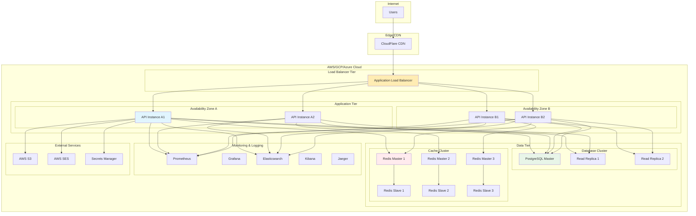

### Container Orchestration (Kubernetes)

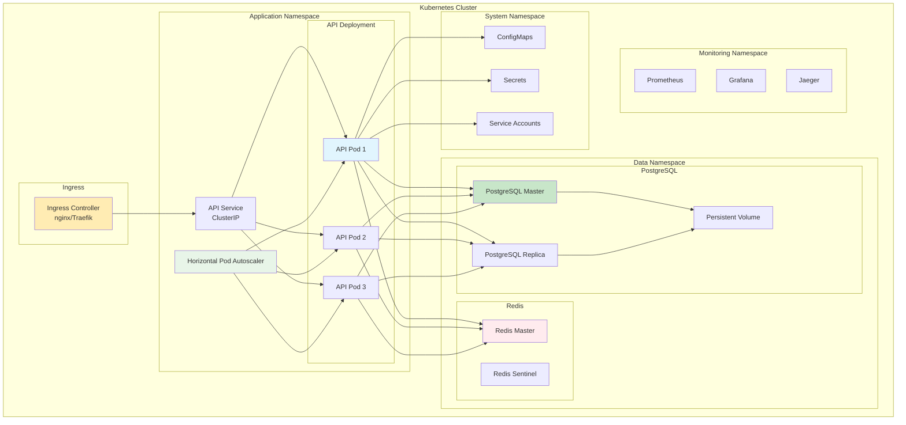

## Performance & Scalability Diagrams

### Auto-scaling Architecture

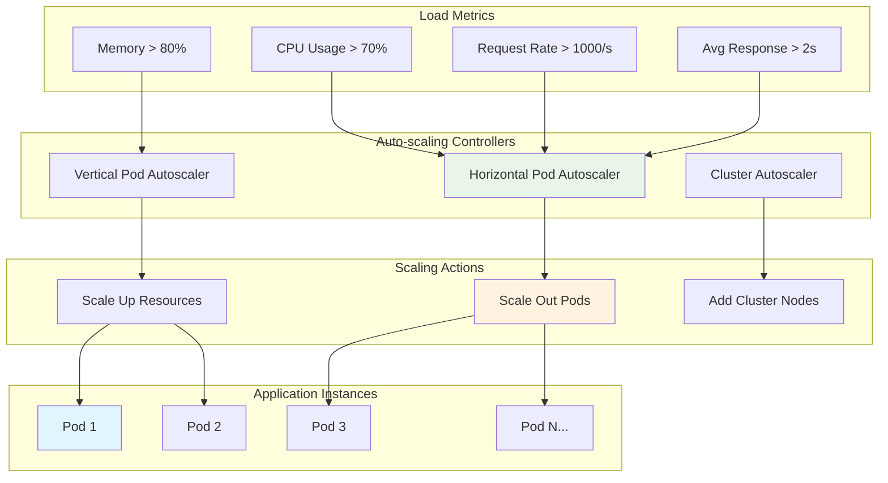

### Database Scaling Strategy

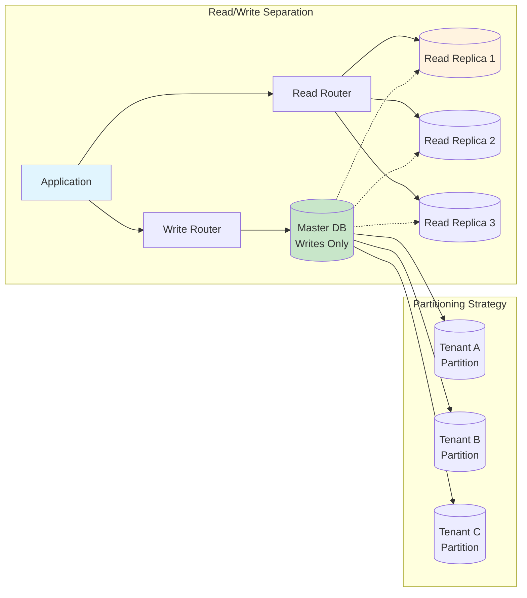

This comprehensive set of diagrams provides visual documentation of the entire system architecture, from high-level context down to detailed component interactions, supporting both development and operational understanding of the REST API system.