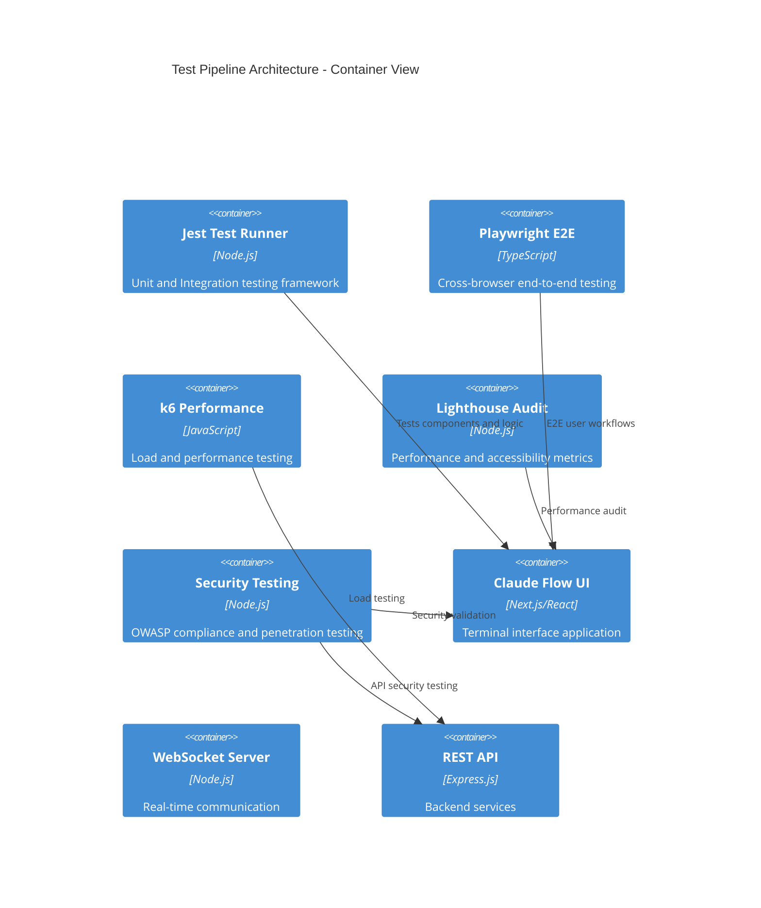
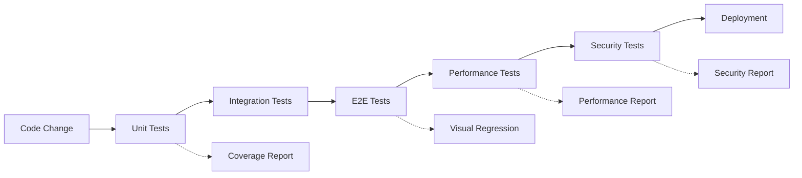

# Test Pipeline Architecture

## Architecture Decision Record (ADR) - Test Pipeline Design

**Status:** Active
**Date:** 2024-09-24
**Decision Maker:** System Architecture Designer

### Context

The terminal/websocket-based Claude Flow UI application requires a comprehensive testing strategy that ensures reliability, performance, and security across multiple environments and use cases. The system handles real-time terminal interactions, websocket connections, and complex state management.

### Decision

We implement a five-tier testing architecture: Unit → Integration → E2E → Performance → Security, with modular design principles and comprehensive coverage requirements.

## System Architecture Overview

```mermaid
graph TB
    A[Test Pipeline Architecture] --> B[Unit Tests]
    A --> C[Integration Tests]
    A --> D[E2E Tests]
    A --> E[Performance Tests]
    A --> F[Security Tests]

    B --> B1[Components]
    B --> B2[Hooks]
    B --> B3[Utilities]
    B --> B4[Services]

    C --> C1[API Integration]
    C --> C2[WebSocket Flow]
    C --> C3[Database Transactions]
    C --> C4[State Synchronization]

    D --> D1[Multi-Browser]
    D --> D2[Visual Regression]
    D --> D3[Accessibility]
    D --> D4[Mobile Testing]

    E --> E1[Load Testing]
    E --> E2[Stress Testing]
    E --> E3[Performance Metrics]
    E --> E4[Bundle Analysis]

    F --> F1[Input Validation]
    F --> F2[XSS Prevention]
    F --> F3[Command Injection]
    F --> F4[Rate Limiting]
```



## Component Architecture (C4 Model - Level 2)

### Test Pipeline Container View



## 1. Unit Test Architecture

### Design Principles
- **Modular Design**: Each test file under 500 lines
- **Isolation**: Mock external dependencies
- **Comprehensive Coverage**: 90%+ for critical paths
- **Performance**: Fast execution (<30s total)

### Structure
```
tests/unit/
├── components/          # React component tests
│   ├── terminal/       # Terminal-specific components
│   ├── monitoring/     # System monitoring components
│   └── sidebar/        # Navigation components
├── hooks/              # Custom React hooks
│   ├── useTerminal/    # Terminal management
│   ├── useWebSocket/   # WebSocket connections
│   └── useStore/       # State management
├── lib/                # Utility libraries
│   ├── websocket/      # WebSocket client
│   ├── api/            # API client
│   └── utils/          # Helper functions
└── services/           # Business logic services
```

### Testing Patterns
- **React Testing Library**: Component behavior testing
- **Mock Service Worker**: API mocking
- **Jest Mocks**: Dependency isolation
- **Snapshot Testing**: UI consistency
- **Property-Based Testing**: Edge case coverage

## 2. Integration Test Architecture

### Design Principles
- **Cross-Component**: Test component interactions
- **Real Dependencies**: Use actual services where safe
- **Data Flow**: Validate end-to-end data flow
- **State Management**: Test state synchronization

### Structure
```
tests/integration/
├── api-endpoints/          # REST API integration
├── auth-flows/            # Authentication workflows
├── backstage-integration/ # Plugin integration
├── terminal-websocket/    # Terminal communication
├── database-transactions/ # Data persistence
└── state-synchronization/ # Cross-component state
```

### Key Integration Points
- **Terminal ↔ WebSocket**: Real-time communication
- **Authentication ↔ API**: Secure access patterns
- **State Store ↔ Components**: Data consistency
- **Database ↔ Services**: Transaction integrity

## 3. E2E Test Architecture

### Multi-Browser Strategy
- **Primary**: Chromium (full feature set)
- **Compatibility**: Firefox, Safari
- **Mobile**: Chrome Mobile, Safari iOS
- **Accessibility**: NVDA, VoiceOver simulation

### Structure
```
tests/e2e/
├── auth-flows/             # User authentication
├── terminal-workflows/     # Terminal operations
├── websocket-recovery/     # Connection resilience
├── multi-terminal-sessions/# Concurrent terminals
├── performance-monitoring/ # Real-time metrics
├── visual-regression/      # UI consistency
└── accessibility/          # A11y compliance
```

### Test Projects
- **Functional**: Core user workflows
- **Performance**: Real-world performance
- **Visual**: UI regression detection
- **Accessibility**: WCAG compliance
- **Mobile**: Responsive behavior

## 4. Performance Test Architecture

### Testing Strategy
- **K6 Load Testing**: Scalability validation
- **Lighthouse Audits**: Core Web Vitals
- **Bundle Analysis**: Code splitting efficiency
- **Memory Profiling**: Resource optimization

### Structure
```
tests/performance/
├── k6/                    # Load testing scripts
│   ├── smoke/            # Basic functionality
│   ├── load/             # Expected traffic
│   ├── stress/           # Breaking point
│   └── soak/             # Endurance testing
├── lighthouse/           # Web performance
├── benchmarks/           # Custom metrics
└── monitoring/           # Performance tracking
```

### Performance Metrics
- **Response Time**: API and WebSocket latency
- **Throughput**: Concurrent user capacity
- **Resource Usage**: CPU, memory, network
- **Bundle Size**: JavaScript payload optimization
- **Core Web Vitals**: LCP, FID, CLS

## 5. Security Test Architecture

### Security Domains
- **Input Validation**: XSS, injection attacks
- **Authentication**: JWT, session security
- **Authorization**: Role-based access
- **Data Protection**: Encryption, sanitization

### Structure
```
tests/security/
├── input-validation/      # User input safety
├── xss-prevention/        # Cross-site scripting
├── command-injection/     # Terminal command safety
├── session-security/      # Authentication flows
├── rate-limiting/         # DDoS protection
├── owasp-compliance/      # Security standards
└── penetration-testing/   # Attack simulation
```

### Security Testing Patterns
- **Automated Scanning**: OWASP ZAP integration
- **Manual Testing**: Penetration test scripts
- **Input Fuzzing**: Edge case validation
- **Security Headers**: Configuration validation

## Configuration Architecture

### Jest Configuration Hierarchy
```
jest.config.js              # Main configuration
├── jest.config.coverage.js # Enhanced coverage
├── tests/
│   ├── jest.setup.js       # Test environment setup
│   └── utils/
│       ├── globalSetup.js  # Global test initialization
│       └── globalTeardown.js # Cleanup procedures
```

### Playwright Configuration
```
tests/e2e/playwright.config.ts
├── Multi-browser projects
├── Performance testing
├── Visual regression
├── Accessibility validation
└── Mobile responsive testing
```

## Pipeline Integration

### CI/CD Integration Points
- **Pre-commit**: Lint, unit tests
- **PR Validation**: Integration, E2E tests
- **Staging**: Performance, security tests
- **Production**: Smoke tests, monitoring

### Test Execution Flow


## Quality Gates

### Coverage Requirements
- **Global Coverage**: 90% branches, functions, lines, statements
- **Critical Components**: 95% (hooks, lib)
- **UI Components**: 85% minimum
- **Integration**: 80% happy path + error scenarios

### Performance Thresholds
- **Unit Tests**: <30 seconds total
- **Integration Tests**: <2 minutes
- **E2E Tests**: <10 minutes per browser
- **Performance Tests**: <5 minutes per suite

## Monitoring and Reporting

### Test Metrics Dashboard
- **Test Execution Time**: Trend analysis
- **Coverage Trends**: Code quality metrics
- **Failure Rates**: Stability indicators
- **Performance Benchmarks**: Regression detection

### Alerting Strategy
- **Critical Test Failures**: Immediate notification
- **Coverage Drops**: Daily reports
- **Performance Regression**: Threshold alerts
- **Security Issues**: Priority escalation

## Architecture Rationale

### Why This Architecture?

1. **Scalability**: Modular design supports team growth
2. **Reliability**: Multiple test layers catch different issues
3. **Performance**: Optimized for CI/CD efficiency
4. **Security**: Comprehensive security validation
5. **Maintainability**: Clear separation of concerns

### Trade-offs Considered

| Aspect | Chosen Approach | Alternative | Rationale |
|--------|----------------|-------------|-----------|
| Test Runner | Jest | Vitest | Better Next.js integration |
| E2E Framework | Playwright | Cypress | Multi-browser support |
| Performance | K6 | Artillery | Better scripting capabilities |
| Coverage | Istanbul | C8 | Mature ecosystem |
| CI/CD | GitHub Actions | Jenkins | Platform integration |

## Implementation Guidelines

### Test File Structure Template
```typescript
// tests/unit/components/Terminal.test.tsx
describe('Terminal Component', () => {
  describe('Initialization', () => {
    // Setup and basic rendering tests
  });

  describe('WebSocket Integration', () => {
    // Communication tests
  });

  describe('User Interactions', () => {
    // Event handling tests
  });

  describe('Error Scenarios', () => {
    // Error boundary and fallback tests
  });

  describe('Accessibility', () => {
    // A11y compliance tests
  });
});
```

### Performance Test Pattern
```javascript
// tests/performance/k6/load-test.js
import http from 'k6/http';
import ws from 'k6/ws';
import { check } from 'k6';

export let options = {
  stages: [
    { duration: '5m', target: 100 },   // Ramp up
    { duration: '10m', target: 100 },  // Stay at 100 users
    { duration: '5m', target: 0 },     // Ramp down
  ],
};

export default function() {
  // Load test implementation
}
```

## Future Enhancements

### Planned Improvements
- **AI-Generated Tests**: Automated test case generation
- **Visual AI**: Intelligent visual regression detection
- **Chaos Engineering**: Resilience testing
- **A/B Testing**: Feature flag validation
- **Real User Monitoring**: Production insights

### Scalability Considerations
- **Parallel Execution**: Distributed test execution
- **Test Sharding**: Large test suite optimization
- **Cloud Testing**: Cross-environment validation
- **Performance Baselines**: Historical trend analysis

---

This architecture provides a solid foundation for maintaining code quality, performance, and security as the application scales.