# Test Pipeline Architecture Diagrams

## System Context Diagram (C4 Level 1)

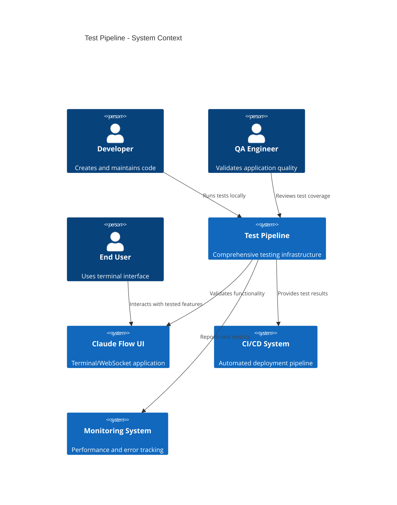

## Container Diagram (C4 Level 2)

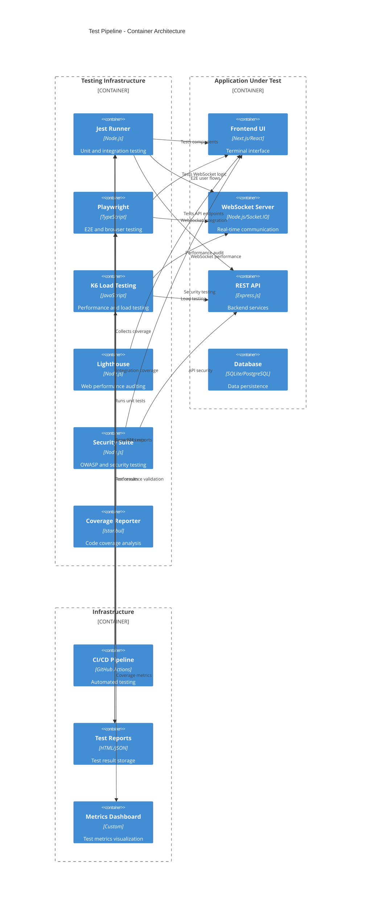

## Test Execution Flow Diagram

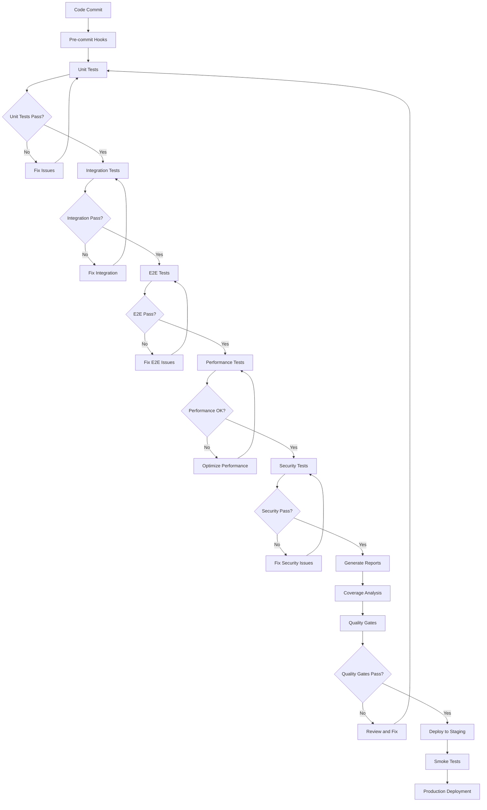

## Test Architecture Layers

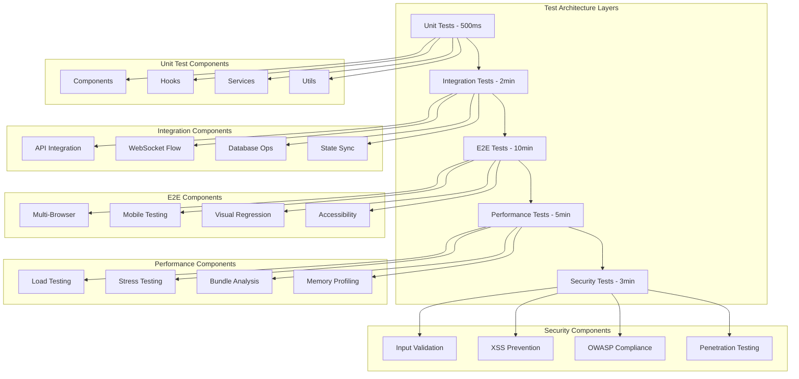

## Test Data Flow Architecture

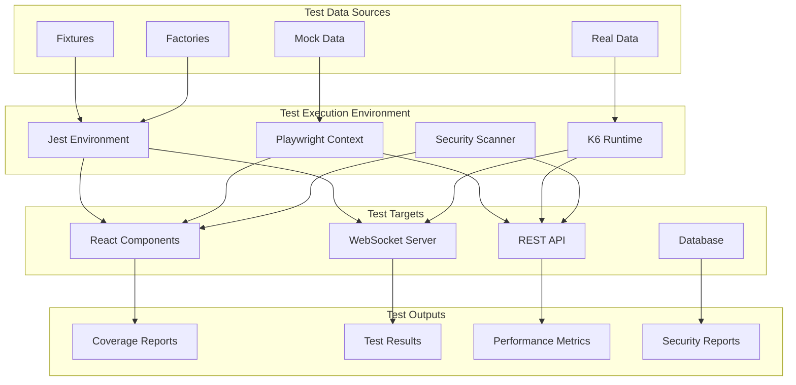

## Component Test Architecture

```mermaid
graph TB
    subgraph "Component Testing Strategy"
        CT1[Isolated Testing] --> CT2[Mock Dependencies]
        CT2 --> CT3[Render Component]
        CT3 --> CT4[Assert Behavior]
        CT4 --> CT5[Snapshot Comparison]
    end

    subgraph "Hook Testing Strategy"
        HT1[Custom Hook] --> HT2[renderHook]
        HT2 --> HT3[Act on Hook]
        HT3 --> HT4[Assert State]
        HT4 --> HT5[Test Side Effects]
    end

    subgraph "Service Testing Strategy"
        ST1[Service Function] --> ST2[Mock External Deps]
        ST2 --> ST3[Call Function]
        ST3 --> ST4[Assert Output]
        ST4 --> ST5[Verify Side Effects]
    end

    subgraph "Integration Testing Strategy"
        IT1[Multiple Components] --> IT2[Real Dependencies]
        IT2 --> IT3[User Interaction]
        IT3 --> IT4[Assert Data Flow]
        IT4 --> IT5[Verify State Changes]
    end
```

## Performance Testing Architecture

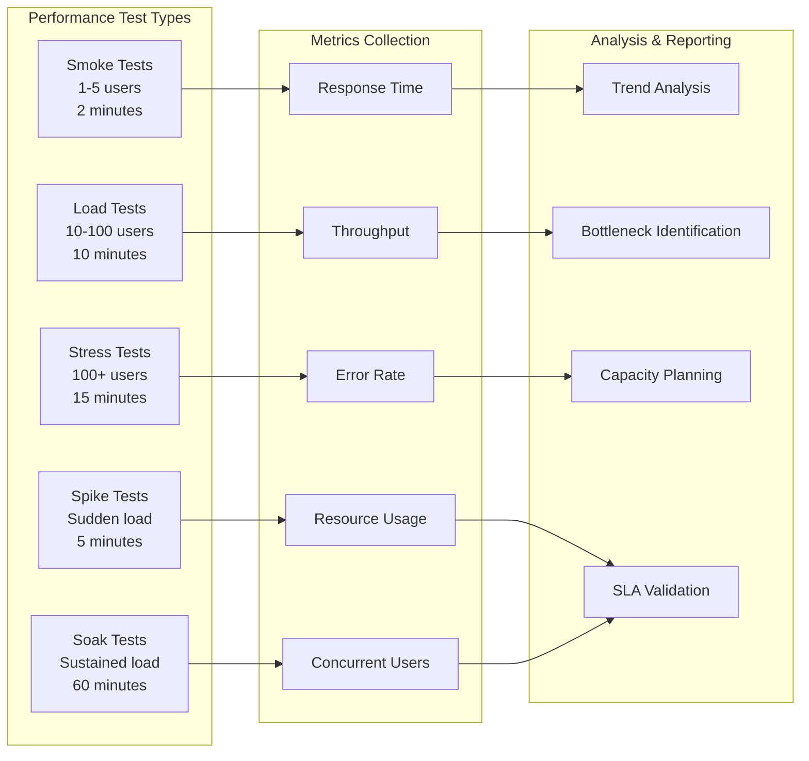

## Security Testing Framework

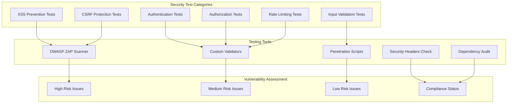

## Test Environment Architecture

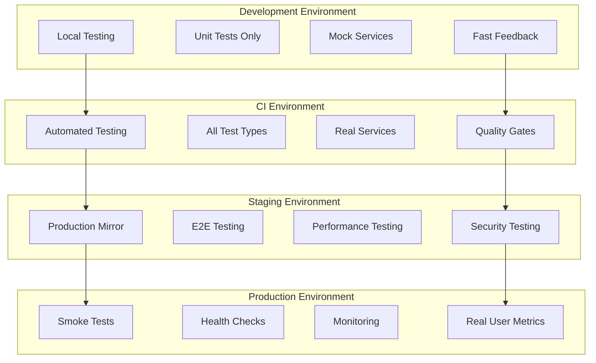

## Quality Gates Decision Flow

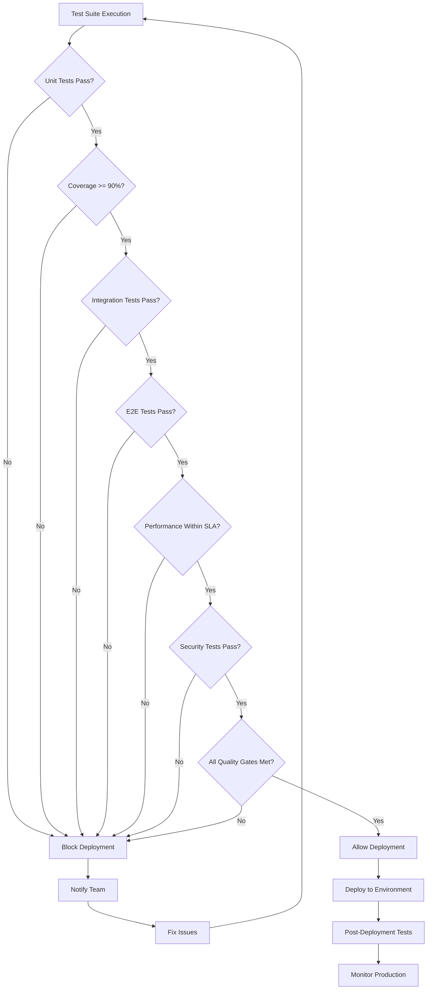

## Test Metrics Dashboard Architecture

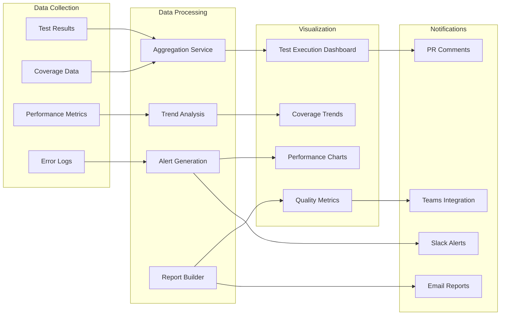

These diagrams provide a comprehensive visual representation of the test pipeline architecture, showing the relationships between different testing components, data flows, and decision points in the testing process.