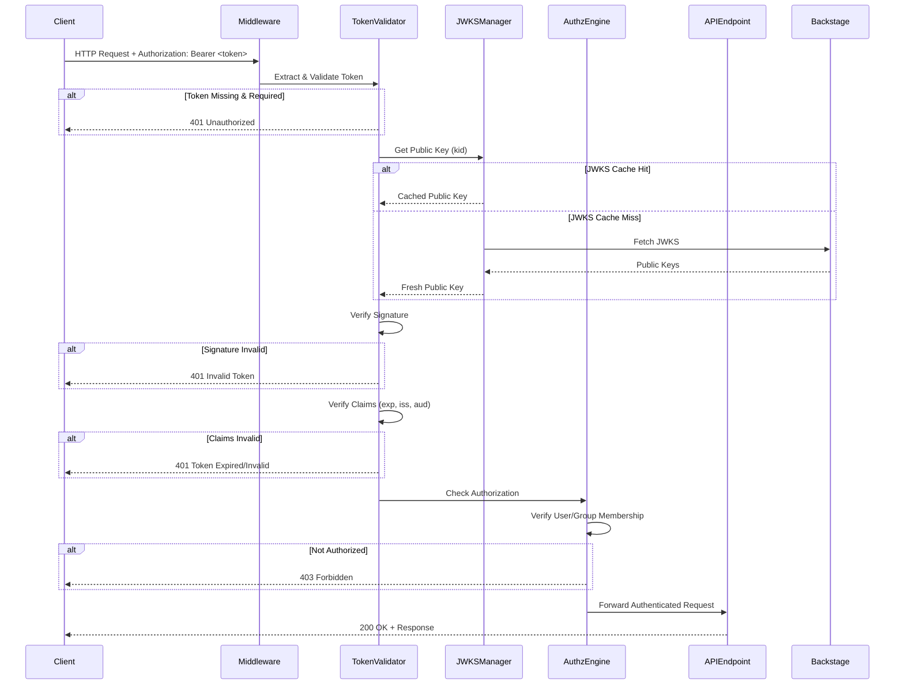

# Backstage JWT Authentication Architecture Design

**Version:** 1.0.0
**Date:** 2025-10-02
**Designer:** System Architect Agent (Hive Mind Swarm)
**Status:** Design Phase

---

## Table of Contents

1. [Executive Summary](#executive-summary)
2. [System Overview](#system-overview)
3. [CLI Options Schema](#cli-options-schema)
4. [Authentication Flow Architecture](#authentication-flow-architecture)
5. [Configuration Structure](#configuration-structure)
6. [Security Design](#security-design)
7. [Error Handling Strategy](#error-handling-strategy)
8. [Implementation Components](#implementation-components)
9. [Integration Points](#integration-points)
10. [Testing Strategy](#testing-strategy)

---

## Executive Summary

This document defines the architecture for integrating Backstage JWT authentication into the Claude Flow UI server. The design prioritizes security, flexibility, and ease of configuration while maintaining backward compatibility with existing unauthenticated deployments.

**Key Design Principles:**
- **Secure by Design**: Authentication is opt-in, not mandatory
- **Zero Trust**: All tokens are validated against JWKS public keys
- **Defense in Depth**: Multiple layers of validation and authorization
- **Fail Secure**: Default to deny access on any validation error
- **Audit Everything**: Comprehensive logging of authentication events

---

## System Overview

### Architecture Context

```
┌─────────────────────────────────────────────────────────────────┐
│                      Backstage Instance                          │
│  ┌──────────────┐    ┌──────────────┐    ┌──────────────┐     │
│  │   Frontend   │───▶│  Auth Plugin │───▶│     JWKS     │     │
│  └──────────────┘    └──────────────┘    └──────────────┘     │
└────────────────────────────────┬────────────────────────────────┘
                                 │ JWT Token
                                 ▼
┌─────────────────────────────────────────────────────────────────┐
│                    Claude Flow UI Server                         │
│  ┌──────────────────────────────────────────────────────────┐  │
│  │            Authentication Middleware Layer                │  │
│  │  ┌────────────┐  ┌──────────────┐  ┌─────────────────┐  │  │
│  │  │   Token    │─▶│  Signature   │─▶│  Authorization  │  │  │
│  │  │ Extraction │  │ Verification │  │     Check       │  │  │
│  │  └────────────┘  └──────────────┘  └─────────────────┘  │  │
│  └──────────────────────────────────────────────────────────┘  │
│                                                                  │
│  ┌──────────────────────────────────────────────────────────┐  │
│  │                  API Endpoints Layer                      │  │
│  │  • Terminal Management  • WebSocket Connections           │  │
│  │  • Configuration APIs   • Health Checks                   │  │
│  └──────────────────────────────────────────────────────────┘  │
└─────────────────────────────────────────────────────────────────┘
```

### Component Responsibilities

| Component | Responsibility |
|-----------|---------------|
| **Token Extractor** | Extract and parse Authorization header |
| **JWKS Manager** | Fetch, cache, and manage public keys |
| **Token Validator** | Verify JWT signature and claims |
| **Authorization Engine** | Check user/group permissions |
| **Identity Resolver** | Map Backstage identity to session |
| **Audit Logger** | Record all authentication events |

---

## CLI Options Schema

### Command Line Arguments

```bash
npx claude-flow-ui \
  --backstage-url "https://backstage.example.com" \
  --jwks-path "/api/.well-known/jwks.json" \
  --allowed-groups "team:platform,team:security" \
  --allowed-users "user:default/admin" \
  --token-required \
  --token-validation-strict \
  --token-cache-ttl 3600 \
  --port 8080
```

### Option Definitions

| Option | Type | Default | Required | Description |
|--------|------|---------|----------|-------------|
| `--backstage-url` | URL | `null` | No | Base URL of Backstage instance |
| `--jwks-path` | String | `/api/.well-known/jwks.json` | No | JWKS endpoint path |
| `--allowed-groups` | CSV | `[]` | No | Comma-separated group entity refs |
| `--allowed-users` | CSV | `[]` | No | Comma-separated user entity refs |
| `--token-required` | Boolean | `false` | No | Enforce authentication on all requests |
| `--token-validation-strict` | Boolean | `true` | No | Enable strict JWT validation |
| `--token-cache-ttl` | Number | `3600` | No | JWKS cache TTL in seconds |
| `--auth-rate-limit` | Number | `5` | No | Max auth attempts per window |
| `--auth-rate-window` | Number | `900000` | No | Rate limit window in milliseconds |

### Environment Variable Mapping

```bash
# Primary configuration
BACKSTAGE_URL="https://backstage.example.com"
BACKSTAGE_JWKS_PATH="/api/.well-known/jwks.json"

# Authorization lists
BACKSTAGE_ALLOWED_GROUPS="team:platform,team:security"
BACKSTAGE_ALLOWED_USERS="user:default/admin,user:default/operator"

# Security settings
BACKSTAGE_TOKEN_REQUIRED="false"
BACKSTAGE_TOKEN_VALIDATION_STRICT="true"
BACKSTAGE_TOKEN_CACHE_TTL="3600"

# Rate limiting
BACKSTAGE_AUTH_RATE_LIMIT="5"
BACKSTAGE_AUTH_RATE_WINDOW="900000"
```

### Validation Rules

1. **URL Validation**: `backstage-url` must be valid HTTPS URL (HTTP allowed in development)
2. **Path Validation**: `jwks-path` must start with `/` and not contain `..`
3. **Entity Ref Format**: User/group refs must match pattern `<kind>:<namespace>/<name>`
4. **TTL Range**: `token-cache-ttl` must be between 60 and 86400 seconds
5. **Rate Limit Range**: `auth-rate-limit` must be between 1 and 1000

---

## Authentication Flow Architecture

### Request Flow Sequence



### Token Validation Pipeline

```javascript
// Validation Pipeline Stages
const validationPipeline = [
  {
    stage: 'extraction',
    function: extractBearerToken,
    onError: 'return 401 if token required'
  },
  {
    stage: 'format_validation',
    function: validateJWTFormat,
    onError: 'return 401 Malformed Token'
  },
  {
    stage: 'header_parsing',
    function: parseJWTHeader,
    onError: 'return 401 Invalid Header'
  },
  {
    stage: 'kid_extraction',
    function: extractKeyId,
    onError: 'return 401 Missing Key ID'
  },
  {
    stage: 'jwks_fetch',
    function: fetchPublicKey,
    onError: 'return 503 JWKS Unavailable',
    retry: { attempts: 3, backoff: 'exponential' }
  },
  {
    stage: 'signature_verification',
    function: verifySignature,
    onError: 'return 401 Invalid Signature'
  },
  {
    stage: 'claims_validation',
    function: validateClaims,
    checks: ['exp', 'iss', 'aud', 'nbf'],
    onError: 'return 401 Invalid Claims'
  },
  {
    stage: 'authorization',
    function: checkAuthorization,
    onError: 'return 403 Forbidden'
  }
];
```

### Identity Resolution

```typescript
interface BackstageIdentity {
  // From JWT claims
  userEntityRef: string;           // "user:default/john.doe"
  ownershipEntityRefs: string[];   // ["user:default/john.doe", "group:default/team-a"]

  // Resolved session data
  localSessionId: string;          // Internal session UUID
  authenticatedAt: Date;           // Authentication timestamp
  expiresAt: Date;                 // Token expiration time
  permissions: string[];           // Resolved permissions
  metadata: Record<string, any>;   // Additional context
}

// Resolution Algorithm
function resolveIdentity(token: JWT): BackstageIdentity {
  const claims = token.payload;

  return {
    userEntityRef: claims.sub,
    ownershipEntityRefs: extractOwnershipRefs(claims),
    localSessionId: generateSessionId(),
    authenticatedAt: new Date(),
    expiresAt: new Date(claims.exp * 1000),
    permissions: resolvePermissions(claims),
    metadata: extractMetadata(claims)
  };
}
```

---

## Configuration Structure

### Configuration File Format

**Location**: `/etc/claude-flow-ui/backstage-auth.json` or `~/.claude-flow-ui/backstage-auth.json`

```json
{
  "$schema": "https://claude-flow-ui.example.com/schemas/backstage-auth.json",
  "version": "1.0.0",
  "backstage": {
    "url": "https://backstage.example.com",
    "jwksPath": "/api/.well-known/jwks.json",
    "tokenRequired": false,
    "tokenValidation": {
      "strictMode": true,
      "verifyExpiration": true,
      "verifyIssuer": true,
      "verifyAudience": false,
      "verifyNotBefore": true,
      "clockTolerance": 60,
      "allowedAlgorithms": ["RS256", "ES256"],
      "maxTokenAge": 86400
    },
    "authorization": {
      "mode": "allowlist",
      "allowedGroups": [
        "team:platform/backend",
        "team:security/admins"
      ],
      "allowedUsers": [
        "user:default/john.doe",
        "user:default/jane.smith"
      ],
      "defaultRole": "viewer",
      "inheritGroupPermissions": true
    },
    "cache": {
      "jwksTtl": 3600,
      "jwksMaxKeys": 10,
      "enabled": true,
      "refreshBeforeExpiry": 300
    },
    "rateLimit": {
      "enabled": true,
      "windowMs": 900000,
      "maxAttempts": 5,
      "blockDuration": 3600000,
      "skipSuccessfulAuth": true
    },
    "logging": {
      "enabled": true,
      "logLevel": "info",
      "logAuthSuccess": true,
      "logAuthFailure": true,
      "includeTokenClaims": false,
      "auditLog": "/var/log/claude-flow-ui/auth-audit.log"
    },
    "security": {
      "enableCors": true,
      "corsOrigins": ["https://backstage.example.com"],
      "requireHttps": true,
      "enforceSecureHeaders": true,
      "csrfProtection": true
    }
  }
}
```

### Configuration Loading Priority

1. **Command line arguments** (highest priority)
2. **Environment variables**
3. **Configuration file** (`/etc/claude-flow-ui/backstage-auth.json`)
4. **User configuration** (`~/.claude-flow-ui/backstage-auth.json`)
5. **Default values** (lowest priority)

### Configuration Validation Schema

```typescript
interface BackstageAuthConfig {
  url: string;                    // Required if any auth feature enabled
  jwksPath: string;               // Default: /api/.well-known/jwks.json
  tokenRequired: boolean;         // Default: false

  tokenValidation: {
    strictMode: boolean;          // Default: true
    verifyExpiration: boolean;    // Default: true
    verifyIssuer: boolean;        // Default: true
    verifyAudience: boolean;      // Default: false
    verifyNotBefore: boolean;     // Default: true
    clockTolerance: number;       // Default: 60 seconds
    allowedAlgorithms: string[];  // Default: ['RS256', 'ES256']
    maxTokenAge: number;          // Default: 86400 seconds
  };

  authorization: {
    mode: 'allowlist' | 'denylist' | 'disabled';
    allowedGroups: string[];
    allowedUsers: string[];
    defaultRole: string;
    inheritGroupPermissions: boolean;
  };

  cache: {
    jwksTtl: number;              // 60-86400 seconds
    jwksMaxKeys: number;          // 1-100 keys
    enabled: boolean;
    refreshBeforeExpiry: number;  // Seconds before expiry to refresh
  };

  rateLimit: {
    enabled: boolean;
    windowMs: number;
    maxAttempts: number;
    blockDuration: number;
    skipSuccessfulAuth: boolean;
  };

  logging: {
    enabled: boolean;
    logLevel: 'debug' | 'info' | 'warn' | 'error';
    logAuthSuccess: boolean;
    logAuthFailure: boolean;
    includeTokenClaims: boolean;
    auditLog: string;
  };

  security: {
    enableCors: boolean;
    corsOrigins: string[];
    requireHttps: boolean;
    enforceSecureHeaders: boolean;
    csrfProtection: boolean;
  };
}
```

---

## Security Design

### Defense in Depth Layers

```
┌─────────────────────────────────────────────────────────────┐
│ Layer 1: Network Security                                   │
│ • HTTPS enforcement                                          │
│ • CORS restrictions                                          │
│ • IP allowlisting (optional)                                │
└─────────────────────────────────────────────────────────────┘
                            │
                            ▼
┌─────────────────────────────────────────────────────────────┐
│ Layer 2: Input Validation                                   │
│ • Token format validation                                    │
│ • Header sanitization                                        │
│ • Entity ref format validation                              │
└─────────────────────────────────────────────────────────────┘
                            │
                            ▼
┌─────────────────────────────────────────────────────────────┐
│ Layer 3: Cryptographic Verification                         │
│ • JWT signature verification (JWKS)                          │
│ • Algorithm allowlist enforcement                            │
│ • Key rotation handling                                      │
└─────────────────────────────────────────────────────────────┘
                            │
                            ▼
┌─────────────────────────────────────────────────────────────┐
│ Layer 4: Claims Validation                                  │
│ • Expiration check (exp)                                     │
│ • Issuer validation (iss)                                    │
│ • Audience validation (aud)                                  │
│ • Not-before check (nbf)                                     │
│ • Clock skew tolerance                                       │
└─────────────────────────────────────────────────────────────┘
                            │
                            ▼
┌─────────────────────────────────────────────────────────────┐
│ Layer 5: Authorization                                      │
│ • User allowlist check                                       │
│ • Group membership verification                              │
│ • Permission resolution                                      │
│ • Role-based access control                                  │
└─────────────────────────────────────────────────────────────┘
                            │
                            ▼
┌─────────────────────────────────────────────────────────────┐
│ Layer 6: Rate Limiting & Abuse Prevention                   │
│ • Per-IP rate limiting                                       │
│ • Per-user rate limiting                                     │
│ • Temporary account lockout                                  │
│ • Brute force detection                                      │
└─────────────────────────────────────────────────────────────┘
                            │
                            ▼
┌─────────────────────────────────────────────────────────────┐
│ Layer 7: Audit & Monitoring                                 │
│ • Authentication event logging                               │
│ • Failed attempt tracking                                    │
│ • Security event alerting                                    │
│ • Metrics collection                                         │
└─────────────────────────────────────────────────────────────┘
```

### Security Best Practices

#### 1. JWKS Caching Strategy

**Objective**: Minimize JWKS fetch requests while maintaining security

```typescript
class JWKSManager {
  private cache: Map<string, CachedKey>;
  private lastFetch: Date;
  private readonly ttl: number;

  async getPublicKey(kid: string): Promise<JsonWebKey> {
    // Check cache
    const cached = this.cache.get(kid);
    if (cached && !this.isExpired(cached)) {
      return cached.key;
    }

    // Fetch with backoff
    try {
      const keys = await this.fetchJWKS();
      this.updateCache(keys);
      return this.cache.get(kid)?.key;
    } catch (error) {
      // If fetch fails but we have expired cache, use it temporarily
      if (cached && this.isRecentlyExpired(cached)) {
        this.logWarning('Using expired JWKS due to fetch failure');
        return cached.key;
      }
      throw error;
    }
  }

  private async fetchJWKS(): Promise<JsonWebKey[]> {
    const response = await fetch(`${backstageUrl}${jwksPath}`, {
      timeout: 5000,
      retry: { attempts: 3, backoff: 'exponential' }
    });

    if (!response.ok) {
      throw new Error(`JWKS fetch failed: ${response.statusText}`);
    }

    return response.json().keys;
  }
}
```

#### 2. Timing Attack Prevention

**Objective**: Prevent user enumeration through timing analysis

```typescript
async function checkAuthorization(
  identity: BackstageIdentity,
  config: AuthConfig
): Promise<boolean> {
  const userCheck = constantTimeCheck(
    identity.userEntityRef,
    config.allowedUsers
  );

  const groupCheck = constantTimeCheckAny(
    identity.ownershipEntityRefs,
    config.allowedGroups
  );

  // Always perform both checks even if first fails
  const authorized = userCheck || groupCheck;

  // Add small random delay to mask timing differences
  await randomDelay(10, 50);

  return authorized;
}

function constantTimeCheck(value: string, allowlist: string[]): boolean {
  let matches = 0;

  // Check against all entries, don't short-circuit
  for (const allowed of allowlist) {
    if (crypto.timingSafeEqual(
      Buffer.from(value),
      Buffer.from(allowed)
    )) {
      matches++;
    }
  }

  return matches > 0;
}
```

#### 3. Rate Limiting Implementation

**Objective**: Prevent brute force attacks and abuse

```typescript
class AuthRateLimiter {
  private attempts: Map<string, AttemptRecord[]>;
  private blocks: Map<string, Date>;

  async checkRateLimit(
    identifier: string,  // IP or user entity ref
    config: RateLimitConfig
  ): Promise<boolean> {
    // Check if currently blocked
    const blockExpiry = this.blocks.get(identifier);
    if (blockExpiry && blockExpiry > new Date()) {
      throw new RateLimitError('Temporarily blocked');
    }

    // Get recent attempts within window
    const recentAttempts = this.getRecentAttempts(
      identifier,
      config.windowMs
    );

    // Check if exceeds limit
    if (recentAttempts.length >= config.maxAttempts) {
      // Block for configured duration
      this.blocks.set(
        identifier,
        new Date(Date.now() + config.blockDuration)
      );

      this.logSecurityEvent({
        type: 'rate_limit_exceeded',
        identifier,
        attempts: recentAttempts.length
      });

      throw new RateLimitError('Too many attempts');
    }

    return true;
  }

  recordAttempt(identifier: string, success: boolean): void {
    if (!this.attempts.has(identifier)) {
      this.attempts.set(identifier, []);
    }

    this.attempts.get(identifier).push({
      timestamp: new Date(),
      success
    });

    // Clear successful attempts if configured
    if (success && config.skipSuccessfulAuth) {
      this.attempts.delete(identifier);
    }
  }
}
```

#### 4. Secure Error Handling

**Objective**: Prevent information disclosure through error messages

```typescript
function handleAuthenticationError(error: Error): Response {
  // Log detailed error internally
  logger.error('Authentication failed', {
    error: error.message,
    stack: error.stack,
    timestamp: new Date()
  });

  // Return generic error to client
  const genericErrors = {
    TokenExpiredError: 'Authentication failed',
    JsonWebTokenError: 'Authentication failed',
    NotFoundError: 'Authentication failed',
    InvalidSignatureError: 'Authentication failed',
    UnauthorizedError: 'Unauthorized',
    ForbiddenError: 'Forbidden'
  };

  const clientMessage = genericErrors[error.name] || 'Authentication failed';

  return new Response(JSON.stringify({
    error: clientMessage,
    timestamp: new Date().toISOString()
  }), {
    status: error.name === 'ForbiddenError' ? 403 : 401,
    headers: {
      'Content-Type': 'application/json',
      'WWW-Authenticate': 'Bearer realm="Claude Flow UI"',
      'X-Content-Type-Options': 'nosniff',
      'X-Frame-Options': 'DENY'
    }
  });
}
```

---

## Error Handling Strategy

### Error Classification

| Error Category | HTTP Status | Client Message | Internal Logging | Retry Strategy |
|----------------|-------------|----------------|------------------|----------------|
| Token Missing | 401 | "Authentication required" | Log IP, endpoint | No retry |
| Token Malformed | 401 | "Invalid token format" | Log token header | No retry |
| Signature Invalid | 401 | "Authentication failed" | Log kid, algorithm | No retry |
| Token Expired | 401 | "Token expired" | Log expiry time | Refresh token |
| Claims Invalid | 401 | "Authentication failed" | Log claim name | No retry |
| JWKS Unavailable | 503 | "Service temporarily unavailable" | Log error, URL | Retry with backoff |
| User Not Allowed | 403 | "Forbidden" | Log user ref | No retry |
| Group Not Allowed | 403 | "Forbidden" | Log groups | No retry |
| Rate Limit Exceeded | 429 | "Too many requests" | Log identifier | Retry after delay |

### Error Response Format

```typescript
interface AuthErrorResponse {
  error: {
    message: string;          // Generic client-safe message
    code: string;             // Error code for client handling
    timestamp: string;        // ISO 8601 timestamp
    requestId?: string;       // Correlation ID for support
  };
  meta?: {
    retryAfter?: number;      // Seconds until retry allowed
    documentation?: string;   // Link to auth documentation
  };
}

// Example responses
const responses = {
  unauthorized: {
    error: {
      message: "Authentication required",
      code: "AUTH_REQUIRED",
      timestamp: "2025-10-02T20:00:00Z"
    },
    meta: {
      documentation: "https://docs.example.com/auth"
    }
  },

  rateLimited: {
    error: {
      message: "Too many authentication attempts",
      code: "RATE_LIMIT_EXCEEDED",
      timestamp: "2025-10-02T20:00:00Z"
    },
    meta: {
      retryAfter: 900
    }
  },

  serviceUnavailable: {
    error: {
      message: "Authentication service temporarily unavailable",
      code: "SERVICE_UNAVAILABLE",
      timestamp: "2025-10-02T20:00:00Z"
    },
    meta: {
      retryAfter: 30
    }
  }
};
```

### Audit Logging Format

```typescript
interface AuthAuditLog {
  timestamp: Date;
  eventType: 'auth_success' | 'auth_failure' | 'rate_limit' | 'security_event';
  level: 'info' | 'warn' | 'error';

  // Request context
  requestId: string;
  ipAddress: string;
  userAgent: string;
  endpoint: string;

  // Authentication details
  userEntityRef?: string;
  groups?: string[];
  tokenKid?: string;

  // Error details (if failure)
  errorType?: string;
  errorMessage?: string;

  // Security metadata
  rateLimitStatus?: {
    current: number;
    max: number;
    windowMs: number;
  };

  // Performance metrics
  validationDurationMs: number;
  jwksCacheHit: boolean;
}
```

---

## Implementation Components

### File Structure

```
src/
├── middleware/
│   ├── authentication.ts          # Main auth middleware
│   ├── authorization.ts           # Authorization checks
│   └── rate-limiter.ts           # Rate limiting logic
├── services/
│   ├── jwks-manager.ts           # JWKS fetching and caching
│   ├── token-validator.ts        # JWT validation
│   └── identity-resolver.ts      # Backstage identity mapping
├── config/
│   ├── backstage-auth.ts         # Configuration schema and loading
│   └── security-defaults.ts      # Security default values
├── utils/
│   ├── constant-time.ts          # Timing attack prevention
│   ├── entity-ref.ts             # Entity ref parsing/validation
│   └── audit-logger.ts           # Audit logging utilities
└── types/
    ├── backstage-identity.ts     # TypeScript interfaces
    └── auth-config.ts            # Configuration types

tests/
└── security/
    ├── auth-security.test.ts              # Existing test file
    ├── backstage-auth-integration.test.ts # New integration tests
    ├── backstage-jwt-validation.test.ts   # JWT-specific tests
    └── backstage-authorization.test.ts    # Authorization tests
```

### Key Interfaces

```typescript
// src/types/backstage-identity.ts
export interface BackstageIdentity {
  userEntityRef: string;
  ownershipEntityRefs: string[];
  claims: BackstageTokenClaims;
}

export interface BackstageTokenClaims {
  sub: string;                    // User entity ref
  ent: string[];                  // Ownership entity refs
  iss: string;                    // Issuer (Backstage URL)
  aud: string;                    // Audience
  exp: number;                    // Expiration timestamp
  iat: number;                    // Issued at timestamp
  nbf?: number;                   // Not before timestamp
}

// src/types/auth-config.ts
export interface BackstageAuthConfig {
  url: string;
  jwksPath: string;
  tokenRequired: boolean;
  tokenValidation: TokenValidationConfig;
  authorization: AuthorizationConfig;
  cache: CacheConfig;
  rateLimit: RateLimitConfig;
  logging: LoggingConfig;
  security: SecurityConfig;
}
```

---

## Integration Points

### Unified Server Integration

**Location**: `/Users/liam.helmer/repos/liamhelmer/claude-flow-ui/unified-server.js`

```javascript
// Add authentication middleware
const { createAuthMiddleware } = require('./src/middleware/authentication');
const backstageConfig = loadBackstageConfig();

if (backstageConfig.enabled) {
  console.log('✅ Backstage authentication enabled');

  // Apply to all API routes
  app.use('/api/*', createAuthMiddleware(backstageConfig));

  // Optional: protect WebSocket connections
  io.use(createSocketAuthMiddleware(backstageConfig));
}
```

### API Endpoint Protection

```javascript
// Protected endpoints (require authentication if configured)
const protectedEndpoints = [
  '/api/terminals',
  '/api/terminals/spawn',
  '/api/terminals/:id',
  '/api/terminal-config/:sessionId'
];

// Public endpoints (always accessible)
const publicEndpoints = [
  '/api/health',
  '/api/ws'  // Initial WebSocket upgrade
];
```

### WebSocket Authentication

```javascript
io.use(async (socket, next) => {
  if (!backstageConfig.tokenRequired) {
    return next();
  }

  try {
    // Extract token from handshake
    const token = socket.handshake.auth.token;

    // Validate and resolve identity
    const identity = await validateAndResolveIdentity(token);

    // Attach to socket
    socket.data.backstageIdentity = identity;

    next();
  } catch (error) {
    next(new Error('Authentication failed'));
  }
});
```

---

## Testing Strategy

### Test Categories

1. **Unit Tests** - Individual component validation
   - Token validation logic
   - JWKS manager caching
   - Entity ref parsing
   - Rate limiter algorithms

2. **Integration Tests** - End-to-end authentication flows
   - Valid token acceptance
   - Invalid token rejection
   - JWKS fetching and caching
   - Authorization checks

3. **Security Tests** - Attack scenario validation
   - JWT manipulation attempts
   - Timing attack prevention
   - Rate limit enforcement
   - Information disclosure prevention

4. **Performance Tests** - Scalability validation
   - Concurrent authentication requests
   - JWKS cache efficiency
   - Rate limiter performance

### Test Coverage Requirements

| Component | Unit Test Coverage | Integration Test Coverage |
|-----------|-------------------|--------------------------|
| Token Validator | 95%+ | 90%+ |
| JWKS Manager | 90%+ | 85%+ |
| Authorization Engine | 95%+ | 90%+ |
| Rate Limiter | 90%+ | 85%+ |
| Middleware | 85%+ | 95%+ |

### Security Test Scenarios

```typescript
// tests/security/backstage-jwt-validation.test.ts
describe('Backstage JWT Security', () => {
  test('rejects tampered signature', async () => {
    const token = createTokenWithTamperedSignature();
    await expect(validateToken(token)).rejects.toThrow('Invalid signature');
  });

  test('rejects expired token', async () => {
    const token = createExpiredToken();
    await expect(validateToken(token)).rejects.toThrow('Token expired');
  });

  test('rejects algorithm confusion attacks', async () => {
    const token = createAlgorithmConfusionToken();
    await expect(validateToken(token)).rejects.toThrow('Invalid algorithm');
  });

  test('prevents timing attacks in user checks', async () => {
    const timings = await measureAuthorizationTimings();
    expect(timings.variance).toBeLessThan(5); // Less than 5ms variance
  });
});
```

---

## Architecture Decision Records

### ADR-001: JWT-Only Authentication

**Status**: Accepted
**Decision**: Use JWT-based authentication exclusively, no session cookies
**Rationale**: Backstage uses JWT tokens; adding session management adds complexity
**Consequences**: Stateless authentication, requires client to manage token refresh

### ADR-002: Opt-In Authentication

**Status**: Accepted
**Decision**: Authentication is disabled by default, explicit opt-in required
**Rationale**: Maintains backward compatibility, allows gradual adoption
**Consequences**: Existing deployments unaffected, new deployments need configuration

### ADR-003: JWKS Caching Strategy

**Status**: Accepted
**Decision**: Cache JWKS with TTL, fallback to expired cache on fetch failure
**Rationale**: Reduces latency and Backstage load, maintains availability
**Consequences**: Brief window of vulnerability if key compromised before cache expires

### ADR-004: Generic Error Messages

**Status**: Accepted
**Decision**: Return generic error messages to clients, detailed logging internally
**Rationale**: Prevents information disclosure that aids attackers
**Consequences**: Reduced debugging information for legitimate users

---

## Next Steps

1. **Implementation Phase** - Coder agent implements components based on this design
2. **Testing Phase** - Tester agent creates comprehensive test suites
3. **Security Review** - Reviewer agent validates security measures
4. **Documentation** - Technical writer creates user-facing documentation
5. **Integration** - DevOps agent integrates with CI/CD pipeline

---

**Document Metadata:**
- **Created**: 2025-10-02
- **Author**: System Architect Agent (Hive Mind Swarm)
- **Version**: 1.0.0
- **Status**: Design Phase Complete
- **Next Review**: Implementation Phase Kickoff
