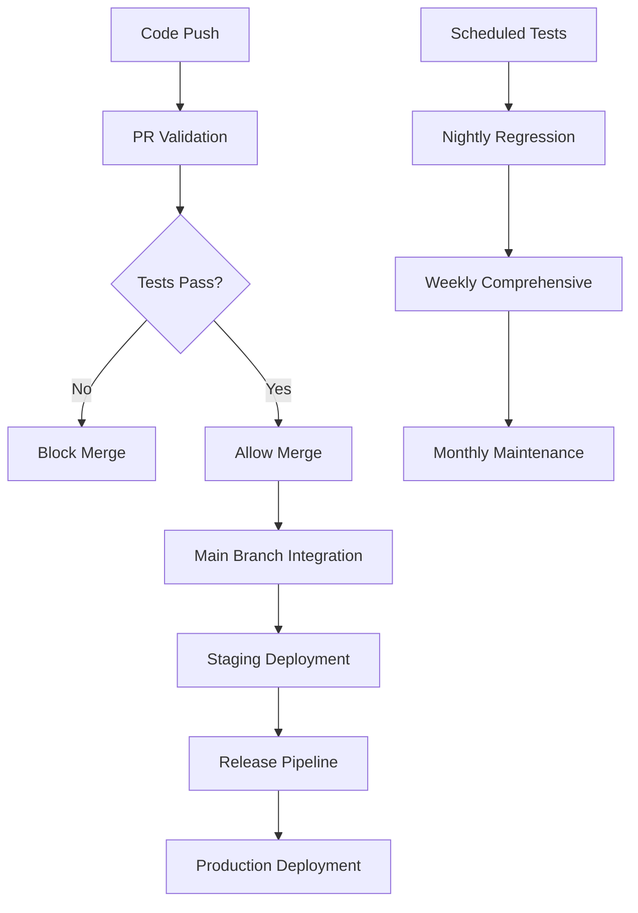

# Testing Strategy for Claude Flow UI

This document outlines the comprehensive testing strategy implemented in the CI/CD pipeline.

## Testing Pyramid

```
              /\
             /  \
            / E2E \
           /______\
          /        \
         /Integration\
        /____________\
       /              \
      /   Unit Tests   \
     /________________\
```

## Test Categories

### 1. Unit Tests (Base Layer)
**Purpose:** Test individual components and functions in isolation
**Coverage Target:** 90% for releases, 80% for PRs
**Tools:** Jest, React Testing Library
**Location:** `tests/unit/`, `src/**/__tests__/`

**Key Areas:**
- React component functionality
- Utility functions
- Hooks and custom logic
- State management (Zustand)
- Data transformations

**Example Structure:**
```typescript
// tests/unit/components/Terminal.test.tsx
describe('Terminal Component', () => {
  test('renders terminal interface', () => {
    render(<Terminal />);
    expect(screen.getByRole('textbox')).toBeInTheDocument();
  });

  test('handles input correctly', async () => {
    const user = userEvent.setup();
    render(<Terminal />);
    await user.type(screen.getByRole('textbox'), 'ls -la');
    expect(mockExecuteCommand).toHaveBeenCalledWith('ls -la');
  });
});
```

### 2. Integration Tests (Middle Layer)
**Purpose:** Test component interactions and service integrations
**Coverage Target:** Full integration flows
**Tools:** Jest, Supertest, Real services (PostgreSQL, Redis)
**Location:** `tests/integration/`

**Key Areas:**
- API endpoint functionality
- Database operations
- WebSocket connections
- Service-to-service communication
- Authentication flows

**Example Structure:**
```typescript
// tests/integration/websocket.test.ts
describe('WebSocket Integration', () => {
  let server: Server;
  let client: Socket;

  beforeEach(() => {
    server = createTestServer();
    client = createTestClient();
  });

  test('establishes terminal connection', async () => {
    await client.emit('create-terminal', { cols: 80, rows: 24 });
    const response = await waitForEvent(client, 'terminal-created');
    expect(response.terminalId).toBeDefined();
  });
});
```

### 3. End-to-End Tests (Top Layer)
**Purpose:** Test complete user workflows and system behavior
**Coverage Target:** Critical user journeys
**Tools:** Playwright
**Location:** `tests/e2e/`

**Test Projects:**
- **Chromium** - Primary testing browser
- **Firefox** - Cross-browser compatibility
- **WebKit** - Safari compatibility
- **Mobile Chrome** - Mobile responsiveness
- **Mobile Safari** - iOS compatibility
- **Accessibility** - WCAG compliance
- **Visual** - Visual regression testing
- **Performance** - Core Web Vitals

## Test Execution Strategy

### PR Validation (Fast Feedback)
**Duration:** 8-12 minutes
**Focus:** Critical functionality

```yaml
Test Matrix:
  - Unit Tests: All (80% coverage)
  - Integration Tests: Core services
  - E2E Tests: Smoke tests only (@smoke tag)
  - Browser: Chromium only
  - Node Versions: 18.x, 20.x, 22.x
```

### Main Branch Integration (Comprehensive)
**Duration:** 25-35 minutes
**Focus:** Full validation

```yaml
Test Matrix:
  - Unit Tests: All (90% coverage)
  - Integration Tests: Full service stack
  - E2E Tests: All critical flows
  - Browsers: Chromium, Firefox, WebKit
  - Node Versions: 18.x, 20.x, 22.x
  - Performance: Lighthouse, Load testing
```

### Release Pipeline (Production Ready)
**Duration:** 45-60 minutes
**Focus:** Release confidence

```yaml
Test Matrix:
  - All tests from Main Branch Integration
  - Security: OWASP, Vulnerability scanning
  - Accessibility: WCAG 2.1 AA compliance
  - Mobile: Responsive design validation
  - Performance: Regression detection
  - API: Contract validation
```

### Scheduled Testing (Monitoring)
**Frequency:** Nightly, Weekly, Monthly
**Focus:** Regression prevention

```yaml
Nightly (2 AM UTC):
  - Smoke tests on staging/production
  - Performance monitoring
  - Security scanning

Weekly (Sunday 4 AM UTC):
  - Full regression suite
  - Cross-browser testing
  - Visual regression

Monthly (1st at 6 AM UTC):
  - Dependency updates
  - License compliance
  - Comprehensive security audit
```

## Test Tagging Strategy

### Critical Tags
- `@smoke` - Essential user flows (PR validation)
- `@regression` - Full functionality validation
- `@security` - Security-related tests
- `@performance` - Performance validation
- `@accessibility` - WCAG compliance tests

### Feature Tags
- `@terminal` - Terminal functionality
- `@websocket` - Real-time communication
- `@auth` - Authentication flows
- `@api` - API functionality
- `@ui` - User interface tests

### Environment Tags
- `@staging` - Staging environment tests
- `@production` - Production-safe tests
- `@local` - Local development tests

**Example Usage:**
```typescript
test.describe('User Authentication @smoke @auth', () => {
  test('login with valid credentials', async ({ page }) => {
    // Test implementation
  });
});

test.describe('Terminal Performance @performance @terminal', () => {
  test('handles large output efficiently', async ({ page }) => {
    // Performance validation
  });
});
```

## Coverage Requirements

### Coverage Thresholds
```javascript
// jest.config.js
coverageThreshold: {
  global: {
    branches: 90,    // 90% branch coverage
    functions: 90,   // 90% function coverage
    lines: 90,       // 90% line coverage
    statements: 90   // 90% statement coverage
  },
  // Per-directory thresholds
  './src/hooks/': { branches: 95, functions: 95, lines: 95, statements: 95 },
  './src/lib/': { branches: 95, functions: 95, lines: 95, statements: 95 },
  './src/components/': { branches: 85, functions: 85, lines: 85, statements: 85 }
}
```

### Coverage Exclusions
- Configuration files
- Type definitions
- Test utilities
- Build scripts
- Third-party integrations

## Performance Testing

### Lighthouse Audits
**Thresholds:**
- Performance: ≥80 (production), ≥75 (staging)
- Accessibility: ≥95
- Best Practices: ≥90
- SEO: ≥85

### Load Testing
**Metrics:**
- Requests/second: ≥100 (staging), ≥50 (production)
- Average Latency: <500ms
- P99 Latency: <2000ms
- Error Rate: <1%

### Core Web Vitals
- **First Contentful Paint (FCP):** <2s
- **Largest Contentful Paint (LCP):** <4s
- **First Input Delay (FID):** <300ms
- **Cumulative Layout Shift (CLS):** <0.1
- **Total Blocking Time (TBT):** <300ms

## Security Testing

### Vulnerability Scanning
- npm audit (critical/high severity blocking)
- OWASP dependency check
- License compliance validation
- Container security scanning (if applicable)

### Security Test Coverage
- Authentication bypass attempts
- Authorization validation
- Input sanitization
- XSS prevention
- CSRF protection
- SQL injection prevention

## Accessibility Testing

### WCAG 2.1 AA Compliance
- Keyboard navigation
- Screen reader compatibility
- Color contrast validation
- Focus management
- ARIA attributes
- Semantic HTML structure

### Testing Tools
- axe-core (automated testing)
- Manual keyboard navigation
- Screen reader testing (NVDA, JAWS, VoiceOver)
- Color blindness simulation

## Visual Regression Testing

### Screenshot Comparison
- Full page screenshots
- Component-level screenshots
- Mobile responsive layouts
- Cross-browser consistency
- Theme variations (if applicable)

### Visual Test Strategy
```typescript
test('homepage visual regression', async ({ page }) => {
  await page.goto('/');
  await expect(page).toHaveScreenshot('homepage.png');
});

test('terminal component visual', async ({ page }) => {
  await page.goto('/terminal');
  const terminal = page.locator('[data-testid="terminal"]');
  await expect(terminal).toHaveScreenshot('terminal-component.png');
});
```

## Test Data Management

### Test Database
- Isolated test database per test run
- Seed data for consistent testing
- Cleanup after each test suite
- Transaction rollback for unit tests

### Mock Strategy
- External API calls mocked
- File system operations mocked
- Network requests intercepted
- Time-based operations controlled

## Continuous Integration Flow



## Test Environment Management

### Environment Isolation
- Each test run gets isolated environment
- Services containerized for consistency
- Environment variables controlled
- State cleaned between runs

### Test Environment Configuration
```yaml
Test Environment:
  Database: PostgreSQL 15 (isolated)
  Cache: Redis 7 (isolated)
  Node.js: Multiple versions (18, 20, 22)
  Browser: Latest stable versions
  Network: Localhost only
  Timeout: 30 seconds default
```

## Monitoring and Reporting

### Test Metrics Tracked
- Test execution time trends
- Flaky test identification
- Coverage trends over time
- Performance regression detection
- Security vulnerability trends

### Reporting Channels
- GitHub PR status checks
- Codecov coverage reports
- Lighthouse performance reports
- Slack/Discord notifications (optional)
- GitHub issue creation for failures

## Best Practices

### Test Writing Guidelines
1. **Follow AAA Pattern:** Arrange, Act, Assert
2. **Test Behavior, Not Implementation:** Focus on what, not how
3. **Use Descriptive Test Names:** Should read like documentation
4. **Keep Tests Independent:** No shared state between tests
5. **Mock External Dependencies:** Control external factors
6. **Test Edge Cases:** Happy path and error conditions

### Test Organization
1. **Group Related Tests:** Use describe blocks effectively
2. **Use Page Object Model:** For E2E tests
3. **Shared Test Utilities:** Reusable setup and helpers
4. **Test Data Builders:** Consistent test data creation
5. **Custom Matchers:** Domain-specific assertions

### Performance Optimization
1. **Parallel Execution:** Run tests concurrently when safe
2. **Test Sharding:** Split large test suites
3. **Resource Cleanup:** Prevent memory leaks
4. **Selective Testing:** Run only affected tests when possible
5. **Test Timeouts:** Reasonable but not excessive

## Troubleshooting Guide

### Common Issues
1. **Flaky Tests:** Environment dependencies, timing issues
2. **Slow Tests:** Database operations, network calls
3. **Coverage Gaps:** Untested code paths, missing edge cases
4. **Build Failures:** Dependency conflicts, environment issues

### Debug Strategies
1. **Local Reproduction:** Run tests locally with same conditions
2. **Debug Mode:** Run Playwright with --debug flag
3. **Verbose Logging:** Enable detailed test output
4. **Screenshot on Failure:** Visual debugging for E2E tests
5. **Network Inspection:** Check API calls and responses

---

*This testing strategy ensures high-quality, reliable, and maintainable code while providing fast feedback to developers and confidence in releases.*